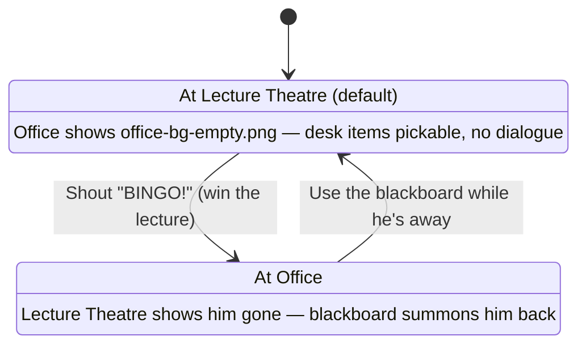

# The Secret of the Lost Codebook — Handover

*Project handover / internal reference — compiled 2026-09-15, last updated 2026-09-19 after the Act II build, sprites, interludes, preloading and the v49 publish*

A LucasArts-style point-and-click adventure teaching Research Methods, built as a single self-contained HTML file. This is the orientation doc for picking the project back up — what's live, how it's wired together, and what's still open.

**Play the current build:** https://claude.ai/artifact/1VJHdVezyJFxnsZXS3kRi6 (v51 · 2026-09-20 · Acts I–V; Act II fully built, voiced, animated)

**v51 is live (2026-09-20)** and matches the local build and GitHub `main` (https://github.com/thomas-u-grund/MethodsGame): everything in sections 01b–01k is published — all of Act I (voiced), all four Act II rooms with character sprites, the Doorman, the Act I/Act II "Starring" posters and ACT title cards, the Act II trailer interlude, and per-act preloading with progress bars. **Lesson that keeps recurring: local edits and headless-Chrome "it worked" do NOT mean the change is live** — the Artifact must be republished explicitly, with every new/changed asset passed in `files` (recipe in section 01k).

---

## 01b. Session changes (2026-09-17 — not yet published)

**Title renamed:** "The Secret of the Codebook" → **"The Secret of the Lost Codebook"** everywhere (`<title>`, `.gametitle`, both HANDOVER/ROADMAP docs). The game file itself was not renamed (still `the-secret-of-the-codebook.html`) to avoid breaking the existing published URL/bookmarks.

**Narrative throughline added.** Until this session "codebook" appeared nowhere in actual game text — only in the page title and internal JS names. Fixed with four small text edits, no restructuring:
- Lecture Theatre's opening line no longer spoils the bingo-card solution outright (used to say "whatever it is you do with a bingo card, you'll need it in hand first") — now he just rambles systems-theory jargon; the player has to discover the bingo trick themselves.
- The Corridor gate door's `Look At` now names the mystery for the first time: "ARCHIVE OF METHOD — THE CODEBOOK."
- The Doorman's line (on entering with the Question) states the stakes: pass all 4 cases to earn a look at the Codebook, fail and fall.
- The Corridor's `checkWin()` payoff reveals the joke: there is no single book — "the Codebook... is the whole department," setting up Acts II–V as its actual chapters.

**Office sidequest: the citation counter.** Fully implemented per the "light-touch" option logged in ROADMAP — a post-puzzle secret, not a blocker, so it doesn't touch the tuned W0–W4 professor dialogue tree:
- Only reachable after `whirlpoolDone` (already got the Question). `Talk To` the professor again then cycles three new idle lines, the second of which hints at "a small mechanical counter screwed to the corner of the desk."
- Craft: `Use` the pen `with` the corkboard → tears off a blank sticky-note corner, writes a fake citation → grants item `citationslip` ("Fabricated Citation").
- Payoff: `Use` that item `with` the professor → he takes it, the counter ticks over, one-time flag `profCited`.
- **No art yet for the counter prop itself** — it only exists in dialogue text, no scene hotspot. `citationslip` also has no icon (`ITEM_ICONS` entry deliberately omitted), so it renders as the "FA" text-fallback in inventory. Both are cosmetic gaps, not blockers; add a desk-sprite + icon whenever art is generated (same pipeline as every other pickup, see section 04).

**Boot splash + opening trailer, fully wired and tested.** A fixed-position `#bootSplash` overlay now plays before `CODEBOOK_START()` fires:
1. `logo-grundarts.png` (a LucasArts-boot-logo pastiche, real alpha transparency) on black, ~2.2s or click to skip.
2. `title-screen.png` (full-bleed painted title card, 1672×941, no transparency needed) with a "Click to Begin" prompt that only appears once **both** a minimum on-screen time *and* a background preload of every Act I/trailer PNG have completed (see the `PRELOAD` array right above `CODEBOOK_START()`) — so Act I's art is already warm in cache by the time the trailer/map needs it.
3. Clicking Begin always plays the 4-panel Monkey-Island-style narrated trailer (`PANELS` array, same script) — full-bleed art + a caption card + "click or press space to continue," one panel at a time — every visit, not just the first. `CODEBOOK_START()` fires on the last panel.
4. **Escape**, at any point during the trailer, jumps straight to the end (skips remaining panels, calls `CODEBOOK_START()` immediately).

All of the above verified end-to-end via headless Chrome/CDP this session (panel order, returning-player skip, `cc_bg` archway swap).

**Corridor archway art wired in.** `checkWin()` now cross-fades `cc_bg` to `corridor-archway-bg.png` (and clears the old door/label hotspots via `clearZones()`) the moment all 4 cases are solved, instead of just changing text over the last case room's background — same fade pattern `startFall()` already used for the failure state.

**New art shipped this session** (all 1672×941, dropped straight in with no cropping needed): `corridor-archway-bg.png`, `title-screen.png`, `logo-grundarts.png`, `trailer-panel1-rejection.png`, `trailer-panel2-protagonist.png`, `trailer-panel4-legend.png`, `trailer-panel5-arrival.png`. Sources archived in `art/corridor/source-corridor-archway-bg.png` and `art/trailer/source-*.png`.

**Not done — still open:**
- **Trailer panel 3 ("The Rumor") generated and wired in** (2026-09-17, later same day) — all 5 panels now play in order, verified via headless Chrome. The `PANELS`/`PRELOAD` arrays near the bottom of the file are complete.
- **Trailer now always plays, every visit** (the earlier `seenIntro`-skip design was dropped) — **Escape** during the trailer jumps straight to the map instead.
- **Corridor ending rewritten** to match `STORY.md`'s two-stage reveal: `checkWin()` no longer spoils "it's the whole department" — stepping through the archway now plays the Doorman exchange ("Not here." / "This was the door." / "You've completed Chapter One.") and converts the `question` item into a persistent `folder` item (`Research Folder — Question Exists`) instead of deleting it.
- **Bug fix:** inventory items with no icon (the `folder` item above, and the earlier `citationslip` sidequest item) rendered invisible fallback-initial text — cream-colored text on the cream slot background. Fixed via an explicit `color`/`font` rule on `.side-inv-slot.filled`.
- Citation-counter desk prop + `icon-citationslip.png` (see above) — cosmetic only, mechanic works without them.
- Magnifying-glass relocation from a prior session — **this one is done**, confirmed live: it now sits on the desk beside the "Drittmittel-funded" sign (`left:58.5%;top:44%` in `office-bg-empty.png`), not on the floor. Ignore any older note claiming otherwise.

---

## 01l. Session changes (2026-09-19, later): local Chatterbox voices; the Doorman speaks

- **Voice engine: Chatterbox** (Resemble AI, open source), English model only (`ResembleAI/chatterbox`, ~3 GB of weights in the Hugging Face cache), installed in the git-ignored `.venv-tts/` (Python 3.11.9 from pyenv, `chatterbox-tts==0.1.7`, torch 2.6, runs on Apple-Silicon MPS at ~2–3 s per line). Chosen over Kokoro/Piper for its `exaggeration` dial (theatrical delivery); the Turbo variant was skipped because it ignores `exaggeration`.
- **Pipeline:** `.venv-tts/bin/python tools/tts/gen.py jobs.json` (committed script; each job = `out`, `text`, optional `ref` reference-voice wav, `exaggeration`, `cfg_weight`, `temperature`, `seed`) → wav in the git-ignored `tools/tts/out/` → `ffmpeg -codec:a libmp3lame -q:a 3` into `web/`. A character's voice = a ~10 s reference clip in `tools/tts/refs/` (currently macOS `say` voices re-rendered through Chatterbox, which keeps the timbre but makes the delivery natural).
- **Reference voices come from LibriVox, not macOS.** Cloning macOS `say` voices kept their unnatural timbre (the user's complaint), so references are now 12 s clips of real LibriVox readers (public domain): one solo chapter downloaded from archive.org (`https://archive.org/download/<id>/<file>_64kb.mp3`; find readers with archive.org advancedsearch, `collection:librivoxaudio AND description:"<reader>"`; identifiers ending in the reader's initials are solo readings), cut with `ffmpeg -ss 75 -t 12 -ar 24000 -ac 1 -af loudnorm` into `tools/tts/refs/lv-<reader>.wav`. Candidates on file: clarke, geeson, yearsley, marksmith, tomweiss, greenman, neufeld. Kokoro was installed in `.venv-tts` as a possible alternative source but its model was never downloaded or used.
- **Professor recast: Martin Geeson** (user's pick of Clarke / Geeson / Yearsley), `exaggeration 0.55`, `cfg_weight 0.45`. All 21 of his clips re-rendered from the game text (10 Office `office-*.mp3`, 11 Lecture Theatre `lecture-*.mp3`; only his spoken words, stage directions excluded, the "blah, blah… systems" ramble kept). Jobs file: `tools/tts/out/jobs-prof-geeson.json` (git-ignored; rebuild from the game text if needed).
- **Doorman cast: Bob Neufeld** (user's pick of four LibriVox readers; replaced the earlier Ralph take), `exaggeration 0.6`, `cfg_weight 0.4`. Six clips: `doorman-noquestion`, `doorman-noskeptic`, `doorman-pass`, `doorman-nothere`, `doorman-thedoor`, `doorman-chapterone` (.mp3), added to `CODEBOOK_ACT_ASSETS.act1`. Only his own words are voiced; narration stays text-only.
- **Corridor wiring:** the Corridor's `setLine(speaker, html, cls, audioSrc)` now takes an optional clip (plays only when given, so System lines don't cut him off). Timers were retimed around the Neufeld clip lengths: gate refusals wait 2.8 s / 10.8 s before the door shuts, the pass line 13.4 s before "You step through", and the archway exchange ("Not here" 2.7 s, "this was the door" 5.8 s, "Chapter One" 9.7 s) hands over the folder at 12.8 s. **If a clip is re-rendered, re-check these timers against its new length.** Verified headless (muted) for all three gate cases.
- **Act I Question changed** to lecture attendance and exam results (see the "Story mismatch resolved" note in 01j); `office-w2.mp3` and `office-w3-callout-a.mp3` regenerated with `say -v Daniel` so the Professor's voice stays consistent until he's recast.
- **Act II voiced + Skeptic recast (same session).** Cast (LibriVox reference → character, all pushed "over the top" at the user's request): Nurse = Ruth Golding (exag 0.85, cfg 0.3), Chair of Consent = Mil Nicholson (0.9 / 0.3), Keeper of Data = Peter Yearsley (0.8 / 0.3), Representative = John Greenman (0.75 / 0.35), Sampling Officer = Andy Minter (1.0 / 0.25), Fieldwork Director = Sibella Denton (1.0 / 0.25), Skeptic = Elizabeth Klett (0.8 / 0.3; her three `pond-skeptic-*.mp3` re-rendered). The Mensa cook is not cast (silent).
- **How Act II playback works:** instead of an audio argument at ~80 call sites, `window.CODEBOOK_VO` (a script block just before the Act II interlude) maps each quoted phrase — the displayed text inside `&ldquo;…&rdquo;`, tags stripped, whitespace collapsed — to a clip `vo-<character>-<md5[:8]>.mp3`. `CODEBOOK_ADV_ROOM`'s `say()` finds every quote in the line, looks each up (`CODEBOOK_VO_CLIPS`) and plays the hits back to back (`CODEBOOK_PLAY_LINE_QUEUE`); if a new line merely extends the previous one (Fieldwork klaxon, approval prefixes), only the appended part is voiced, queued after what's playing. Quotes not in the table stay silent — by design for the player's replies ("Why?", "It's glass.", "So I have data?"…), clause/sign text and chanting participants. The one dynamic line ("We can't go live without …", built from unfinished rooms) is silent. **If you edit an Act II quote's wording, its clip no longer matches** — re-run the extraction (character helper / `api.say` calls, attribution overrides for quotes spoken by someone other than the call's speaker, e.g. the Sampling Officer's "THOSE PEOPLE WERE NOT DRAWN!" inside a Director line) and re-render. All `vo-*.mp3` are appended to `CODEBOOK_ACT_ASSETS.act2`.
- **Not yet pushed or published** at the time of writing.

## 01m. Session changes (2026-09-19, later still): living sprites + first cut-out rig (the Professor walks)

- **Talking + breathing (all voiced sprites).** Every character sprite carries `data-voice="<character>"` (ADV sprites via a `voice` key in the room's `SPRITES` table; the Lecture Theatre professor images and the rig box; `#cc_doorman`). The line-audio engine works out who is speaking from the clip name (`vo-<who>-…`, `office-`/`lecture-` → prof, `doorman-`, `pond-skeptic-`) and adds `.talking` to that character's sprites while the clip plays (removed on `ended`/`pause`, so Space stops it; a queue hands over between speakers). CSS uses the individual `scale`/`translate`/`rotate` properties so it composes with inline transforms: default lean-and-bob, `officer` grand sway, `director` frantic jitter, `rep` slow snore swell, `keeper`/`chair`/`doorman` small nods; everyone breathes when idle (random phase). Respects `prefers-reduced-motion`. Not possible yet where the character is painted into the background (Professor in the Office, Skeptic at the pond).
- **Rig-first walking, piloted on the Professor** (following the logged lesson that per-frame ChatGPT walk cycles drift). ChatGPT drew a side-view paper-doll parts sheet from `prof-walking.png` (`art/characters/professor/rig/parts-sheet.png`); pieces were split by alpha connected components, cropped, rescaled to anatomical lengths (the sheet's proportions were off — the upper arm was nearly torso length; the "thigh" came back as a whole trouser leg and was cropped above the knee crease) and shipped as `web/rig-prof-{head,torso,upperarm,forearm,thigh,shin}.webp` (~170 KB). Engine `CodebookRig` (inline in the game under "CUT-OUT RIGS"; dev copy + pose test page in `tools/rig/`, serve that folder and open `test.html`, `?live=walk` animates): nested joint divs with pivots/attach points from `PROF_RIG`, far limbs darker and behind the torso, lower limb pieces layered *under* the upper ones so joints read as fabric folds instead of circles. Procedural walk cycle (`CodebookRig.walk`, 1.05 s/cycle): thigh sine ±26°, knee flexion peaking early in swing (~50°) and near-straight at heel strike, arms opposite the legs, body bob, slight lean.
- **In the Lecture Theatre** the random "walking" pose now calls `walkRoute([-170, 130, 0])`: the painted sprite crossfades to the rig, which walks each leg at a stride-matched constant speed (`1300 * scale / period` px/s, linear — no foot sliding), mirrors to face its direction, then crossfades back to the lecturing sprite. The rig is sized from the painted sprite's height (`1600/1549`) and placed with its soles on the same floor line. `window.CODEBOOK_DEBUG_PROF_WALK()` triggers a walk for testing. Style note: the rig is a profile view while the painted poses are three-quarter — reads as him turning to walk.
- **Rig pipeline, generalised (same session).** `tools/rig/cut.py <name>` turns `tools/rig/<name>/sheet.png` + `parts.json` (per part: sheet box `w,h,x,y`, crop fractions, target height, width stretch; joints as fractions of each part image) into cleaned part PNGs (alpha levelled to kill any sheet glow) and `rig-def.js`; pose-check with `tools/rig/test2.html?n=<name>&v=<VAR>` (serve `tools/rig/`). Parts ship as `web/rig-<name>-*.webp`; sources in `art/characters/<name>/rig/`. ChatGPT prompt that works: "PAPER-DOLL CUT-OUT PARTS … strict SIDE VIEW facing right … REAL fully transparent background (no glow) … pieces 3–6 only once … rounded extended joint ends … realistic proportions", with the full-size original sprite attached, in the cast chat.
- **Rigged + walking now:** Professor (Lecture Theatre pacing, lean reduced to torso 1.5°), **Doorman** (walks in from the right at the archway, `showDoorman(DOORMAN_ARCH, 30)`), **Sampling Officer** (struts idly; on the successful spin strides to the drum, waits, returns), **Fieldwork Director** (paces restlessly every 7–15 s), **Nurse** (walks to the cabinet when handing out the scissors, to the machine when she stamps the H-27, occasional idle steps). The judges sit behind the bench and aren't rigged.
- **Engine helpers:** `CODEBOOK_RIG_WALK(spriteEl, RIG, route, done, {from, stay})` measures the sprite's drawn figure, builds the rig at the same height with soles on the same floor line (auto-measured from the rig's standing pose, no magic numbers), walks the route (x offsets in % of scene width relative to the sprite; `{wait: ms}` entries stand still), mirrors to face its direction, crossfades back. `CODEBOOK_IDLE_PACE(spriteEl, RIG, routes, minMs, maxMs)` loops random routes while the sprite is on screen. The walking rig box carries `data-voice`, so a character keeps its talking motion while walking. Debug: `CODEBOOK_DEBUG_PROF_WALK()`, `CODEBOOK_DEBUG_CORRIDOR_WIN()`.
- **Mouths.** ChatGPT edit of each full-size original with only the mouth changed → `tools/mouth.sh <name> cx cy rx ry <resize>` cuts a feathered ellipse around the mouth (originals' pixels) and crops/resizes it exactly like the sprite → `web/mouth-<name>.webp`, overlaid 1:1 inside the sprite wrapper, flickered by `.talking` (`cb-mouth`, 0.62 s cycle — the user asked for slower, and for calmer talking motion overall, ~half speed/amplitude). ChatGPT edits sometimes come back at a slightly different size (the Keeper: 1096×1435) — resize to the original and align by `compare -subimage-search` on the nose before cutting. The Director's sprite has an open (shouting) mouth, so hers is inverted (`mouthClosed:true`: a closed-mouth patch shown while silent). Nurse, Chair, Keeper, Officer, Director, Doorman have mouths; the Representative only snores. Sources: `art/sprites/originals/`, `art/sprites/mouths/`.
- **Campus map per act, signs only for enterable rooms.** Two painted bases with no name banners at all: `campus-map-act1.webp` (no tent, two white swans) and `campus-map-act2.webp` (Fieldwork tent, black swan); `showMap()` picks by `corridorDone`. Built from `art/map/source-v1-act1.png` / `source-v2-act2.png` + ChatGPT edits (banners blanked, then removed; right swan painted black), composited back onto the originals with feathered masks only over the banner rectangles and the swan so nothing else drifts (sources: `art/map/map-act*-final.png`). `MAP_LABELS` (in % of the map) draws a signboard (`map-sign.webp`, a ChatGPT parchment banner) + name only when the room is unlocked, so later-act buildings show no sign; the pond's second line becomes a red FALSIFIED stamp from Act II. The Fieldwork tent keeps its painted own sign. Acts III–V: add their rooms to `MAP_LABELS` (Library Annex, Statistics Basement box already there) — nothing else to paint.
- **Character polish (later same day).** Professor in the **Office**: he's painted into `office-bg`, so instead of a sprite he gets a still mouth layer (`#wp_profMouth.cb-still`, full-frame `mouth-prof-office.webp` from a ChatGPT edit of the whole office) that flickers while he talks — no body motion. A difference-mask cut-out was tried and abandoned: ChatGPT's two office versions differ everywhere slightly, so the mask was garbage. Professor in the **Lecture Theatre**: mouth layers per pose (`mouth-prof-lecturing.webp`, `mouth-prof-pointing.webp`, full sprite size, `.cb-mouth-solo`, visibility follows `setPose`), and a **gesturing loop** — while one of his lines plays he alternates lecturing ↔ pointing every 1.7 s, back to lecturing when it ends. The pointing edit came back re-framed (976×1612 vs 856×1647): same figure height, shifted 45 px — aligned by face `-subimage-search` before cutting. **Mensa cook** voiced (LibriVox Tom Weiss, exag 0.8; 4 `vo-cook-*.mp3` in `CODEBOOK_VO`). **Skeptic** deliberately left painted: she sits with her back to the player, so a mouth can't show, and replacing the scene with a front sprite would lose a good composition. **Office nameplate**: the baked-in "DRITTMITTEL-FUNDED STAFF ONLY" is now a blank nameplate in both `office-bg` and `office-bg-empty` (patched from the same ChatGPT edit; originals kept as `art/office/edits/*-with-drittmittel.png`); the magnifying glass's Look At line now jokes about the sanded-off nameplate. Corridor falling art already existed (`corridor-fall-bg`) — stale backlog item removed. `citationslip` now has an icon (`icon-citationslip.png`, ChatGPT, source in `art/icons/`).
- **Act II trailer starts on its own** ~4.5 s after the Doorman hands over the folder (the Corridor's final button is now "Continue →"; either path opens the map, which plays the interlude once).

## 01n. Session changes (2026-09-20): Act I polish pass (roadmap items 1–9)

- **Office patience bug (the reported "right answer, no Question").** `w1/w1b/w2/w3Answer` spent a patience bubble *before* checking the answer, so running out on the winning answer ejected the player. Now the bubble is still spent every time, but only a **wrong** answer can eject: verified that the correct W3 answer on the last bubble hands over the Question, and that a wrong answer at zero still loses.
- **Office re-entry** no longer replays the seven-second interrogation once `whirlpoolDone`: three greetings depending on progress (question / question+folder after `corridorDone` / stamped folder after `actIIDone`, which teases the Act III "where did these numbers come from?" beat).
- **Survey Lab hotspots on the charts**: each patient and the clipboard now have a *second* hotspot box over its floating chart (same id → same handler and hover label), since the chart is what the player reads.
- **Narration vs speech.** `CODEBOOK_IS_NARRATION(speaker, html)` (engine): "System"/blank is narration, a "You" line counts as speech only if it contains `&ldquo;`. The three caption-based rooms toggle `.narration` on `.scene-caption`, which drops the bubble tail and switches to a quieter dark plate.
- **Space always skips.** The global handler no longer requires `e.target === document.body`: it blurs whatever button has focus (so Space doesn't re-trigger it), cuts the line audio and dismisses the caption.
- **End of Act I**: the "Continue to Campus Map" button is gone; after the folder hand-over the map opens by itself (2.6 s) and plays the Act II interlude.
- **Lecture Theatre**: BINGO now makes the professor *lose the thread and walk out* (rig walk to `-980` px with `walkRoute(..., {exit:true})`, then `applyPresence(false)` and the "theatre is empty" line; safety net at 7 s). The bingo card moved **inside** the scene (`.bingo-overlay`, bottom right) so the layout no longer reshuffles. Hidden hint for the trick: a faint 3×3 grid was painted into the notebook doodles (`lecture-bg`, patched from a ChatGPT edit over the notebook only), a new doodle line mentions someone keeping score, and `Use magnifying glass → notebook` reveals "THREE IN A ROW AND HE STOPS". Hints for getting him **back**: the board's Look At (chalk still in the tray, "he can hear a wrong arrow from two corridors away") and an idle line in the empty theatre.
- **Narrated trailers.** 14 narrator clips (LibriVox **Mark F. Smith**, exag 1.0 / cfg 0.25 — the user asked for a grander storyteller than the first pass with David Clarke — `vo-narr-opening-*.mp3`, `vo-narr-act2-*.mp3`, the two title cards read "Act One. The Question." / "Act Two. Apparently, we need data."). Panels take a `voice:` key; both players (boot trailer and `CODEBOOK_PLAY_INTERLUDE`) play it and **auto-advance when the clip ends**, while click/Space still skip (and stop that panel's narration). Trailer music was turned down under the narration (boot 0.55 → 0.2, interlude 0.45 → 0.16).
- **Voice clips ship as one bundle per act.** `voices-act1.mp3` (38 clips, ~3 MB: Office/Lecture professor, pond Skeptic, Doorman, opening-trailer narration) and `voices-act2.mp3` (107 clips, ~5 MB: the Act II cast, cook, Act II narration), each in its act's preload list. Forced by the artifact host's **255-files-per-version limit** (we were at 268) and nicer anyway: one request per act. `CODEBOOK_VOICE_SPRITE` maps every clip name to `[bundle, start, duration]`, and `CODEBOOK_VOICE(src)` returns a `SegmentSound` — Web Audio: the bundle is fetched and decoded once, segments play from memory, and the object mimics the bits of `HTMLAudioElement` the game uses (`play/pause/paused/ended/src` + `ended`/`pause` listeners), so **all call sites still name a single clip**. **Playback went through two dead ends before the working one** (v50 shipped silent — fixed in v51): (1) an `<audio>` element seeking inside the bundle needs HTTP range requests, which the dev server doesn't serve; (2) Web Audio (`decodeAudioData` + `BufferSource`) plays nothing while the context is suspended, which it is until the browser sees a gesture — voices auto-play on room entry, so they were silent. **What works:** fetch each bundle once as a **blob**, `URL.createObjectURL` it, and use a normal `<audio>` with `currentTime = start` — blob URLs seek without server range support and behave like any other audio. Rebuild both bundles + the manifest whenever a clip changes (script pattern in this session's history: concat with 0.45 s gaps, write `[file,start,dur]`).
- **Lecture exit direction**: he leaves to the **right** past the lectern (walking left took him through the seating).

## 01k. Session changes (2026-09-19): v49 published, images switched to WebP, GitHub synced

- **Published as v49** to the same artifact URL. The artifact host caps a version at 64 MB and the referenced assets had grown to ~97 MB, so every image over 400 KB (44 files: all backgrounds, trailer panels, title/logo, professor sprites, the bigger Act II sprites and a few icons) was converted with `cwebp -q 88 -alpha_q 95 -m 6` — 78 MB → 11 MB, visually indistinguishable in side-by-side crops, alpha intact. The whole game is now ~30 MB, which also makes the loading bars fast. References in the HTML were rewritten `.png` → `.webp`; small PNGs (icons, patches) stayed PNG.
- **Full-size PNG originals** of the converted files live in `web-png-originals/` at the repo root — local only, git-ignored. Regenerate a WebP from there if an asset needs re-editing; never edit the WebP and re-encode repeatedly.
- **How to republish** (what produced v49): collect every asset literally referenced in the HTML (`re.findall(r'[A-Za-z0-9_-]+\.(?:png|mp3|m4a|jpg|webp)', html)`), pass them as `files` `{ "name.webp": "web/name.webp", … }` with `url` = the artifact URL, and map any published file that's no longer referenced to `null` so it's removed. `.m4a` is **not** a served type — leave `title-theme.m4a` out; the `<audio>` element falls back to `title-theme.mp3`.
- **Repo:** `sprite-skeptic.png`, `sprite-skeleton.png` (only used to build the Act I poster) and the unused `icon-consentform-thick.png` moved from `web/` to `art/sprites/`, so `web/` holds only what the game loads (plus the old git-ignored prototype HTML files). README status updated. Pushed to `main`.

## 01j. Session changes (2026-09-18, night): Doorman sprite, Act I/II title cards, Act II interlude, Survey Lab patient charts

- **Doorman sprite** (`sprite-doorman.png`, generated in the same ChatGPT chat as the Act II cast): maroon porter's coat, bowler, walrus moustache, arms crossed. Corridor markup has a `#cc_doorman` img; `showDoorman(DOORMAN_GATE | DOORMAN_ARCH | null)` puts him in the gate's doorway whenever he answers the bell, and beside the archway for the "Not here / Chapter One" exchange. `renderGate`/`renderRoom` hide him. Still silent (no voice).
- **Act I "Starring" poster** (`trailer-cast-act1.png`, ImageMagick composite over the blurred office): the Professor behind a gold-framed lectern with the citation counter, the Office skeleton and the Skeptic on the left, the Doorman on the right. It sits just before the ACT I card, mirroring Act II. New sprites made for it: `sprite-skeptic.png` (matches her painted back-view on the pond bench) and `sprite-skeleton.png` ("SUBMITTED 2016 · STILL WAITING"); neither is used in a room yet.
- **ACT I title card** appended to the opening trailer's `PANELS` (reuses the arrival art under a blurred veil); boot trailer panels now accept an optional `title` HTML rendered into `#bootTitleCard`. Shared classes: `.il-veil`, `.il-title` (`.kicker`/`.act`/`.rule`/`.big`/`.sub`).
- **Act II interlude**: `CODEBOOK_PLAY_INTERLUDE(panels, onDone)` (engine) is a fixed 16:9 letterboxed stage so per-panel `html` overlays stay pinned to the art; click/Space/Enter advance, Esc skips (captured, so the dialogue Space handler never sees it). `showMap()` plays `CODEBOOK_ACT2_INTERLUDE` once, the first time the map opens with `corridorDone` and without `act2IntroSeen`/`actIIDone`, with the title theme turned up to 0.45 while it runs. Preview it alone with `?play=act2`. Panels: `trailer2-a-folder.png` (the Question handwritten onto the index card via an SVG matrix-transformed foreignObject), `trailer2-b-prof.png` ("A question is not evidence"), `trailer2-c-h27.png` (H-27 avalanche, box labels overlaid in SVG), `trailer2-d-montage.png` (ImageMagick 2x2 of the four room backgrounds, labels in HTML), `trailer2-e-cast.png` (ImageMagick "Starring" poster from the sprites + `prof-pointing.png` flopped), and an ACT II title card over the campus map. Prompts for A-C are in `art/trailer/ART_PROMPTS.md`.
- **Survey Lab patient charts**: the four ailing questions are now visible as hospital charts hanging above their beds (overlay `#sv_p1..4`, `renderPatients()`); each shows the real wording plus its ailment (tape across a double-barrel, a chart physically leaning, "often" circled with bobbing "?", only YES/NO on the clipboard) and flips to a green STABLE version once fixed. Re-rendered by wrapping `ctx.setFlag` inside the room's init.
- **Per-act preloading with progress bars**: `CODEBOOK_PRELOAD(list, onProgress, onDone)` (engine) fetches each URL once (shared between callers), reports byte-accurate progress via Content-Length, and decodes images into kept-alive `Image`s. `CODEBOOK_ACT_ASSETS = {act1, act2}` lives in the boot script (act1 = the old `PRELOAD` images + all Act I voice/music mp3s; act2 = interlude art, room backgrounds, sprites, icons). Boot shows "Loading Act I · n%" (or "Loading Act II" when the save already has `corridorDone`) on the logo/title screens and only offers "Click to begin" when it's done, then fetches the other act silently in the background. The Act II interlude takes `{preload, label}` and holds on a centred "Preparing Act II · n%" bar before the first panel, so it's usually near-instant thanks to the background fetch. **When Act III gets art, add an `act3` list and pass it to the Act III interlude the same way.**
- **Bug fix**: Fieldwork `board()`/`redButton()` no longer throw when a klaxon timer fires after the player has left the room.
- **Story mismatch resolved (2026-09-19):** the Act I Question is now about **lecture attendance and exam results** — Office W2 correct answer "Do students who attend more lectures get better exam results?", W3 scoping "first-years in the Methods lecture · lectures attended & final exam grade · winter term 2025/26 · direction left open" (wrong options: fixed direction, or "students, generally"). `office-w2.mp3` and `office-w3-callout-a.mp3` were regenerated (`say -v Daniel`); the interlude index card shows the new Question. Act II's attendance survey now fits.

## 01i. Session changes (2026-09-18, late): Act II built in code — all four rooms playable end-to-end

**Published in v49.** Act II now exists as four real verb-grid rooms using the painted art from 01h, replacing the old SVG Mensa and quiz-style Survey Lab entirely.

**Shared scaffolding (engine IIFE):** `CODEBOOK_ADV_HTML(o)` builds a room's markup from a hotspot table (+ optional sprites/overlay); `CODEBOOK_ADV_ROOM(ctx, o)` wires the verb grid, inventory, hover labels and hotspot clicks, and hands each room an `api` (`say`, `choice`, `give`, `take`, `sprite`, `spriteSrc`, `sync`, …). A room is now just a hotspot table plus one `onClick(id, verb, item, api)` function — return `false` for the generic fallback line. Act I rooms were **not** migrated to it (they work; no reason to touch them). `CODEBOOK_H27_HTML()` renders the ☐/☑ H-27 strip shown top-right in every Act II room. The H-27 form is issued (with a one-time pneumatic-tube line) the first time the player walks into *any* Act II room — the Office's tuned dialogue tree was deliberately left alone.

**All four rooms open as soon as the Corridor is done** (`prereq: corridorDone`) — non-linear, as in STORY.md. Each room's `doneFlag` *is* its H-27 box: `surveyDone` INSTRUMENT EXISTS, `ethicsDone` HUMANS MAY BE APPROACHED, `mensaDone` SAMPLE DRAWN, `fieldworkDone` RESPONSES ACQUIRED. When the last one lands, `actIIDone` is set and the Research Folder's label becomes "Question Has Data". **The Library (Act III) now requires `actIIDone`** instead of `surveyDone`. A one-time save migration marks old saves that had already passed the old Survey Lab as Act-II-complete, so nobody gets re-locked.

**Puzzle chains as built** (see STORY.md Act II for the fiction):
- **Survey Lab** — four patients: double-barrel (talk to diagnose → scissors from cabinet → cut), leading question (Use with bare hand to strip it), "often" (needs the torn calendar page from Ethics), YES/NO clipboard (Likert die from the Office — traced, not rolled; not consumed). Machine clears the instrument once all four are stable. Reminder postcards are under the phone.
- **Ethics Tribunal** — plain consent form (on the right pew) used on the Tribunal; chewed pen used on the Irreversible Participation Device (writes WITHDRAW on the buckle); data-protection dialogue with two choices — stamp everything (approved, but sets `overRedacted`, which blocks reminders later in Fieldwork) or number with the pen + redact names + Ledger key (correct; needs pen). Approval hands over the pseudonymised student list + paper questionnaire. Ballot box can only leave once wrapped in the Mensa lunch bag. Calendar page is on the left pillar. Stamp/USB "wrong department"/"is it encrypted?" gags.
- **Mensa** — Use the empty frame with bare hand → wrong tote-bag sample (the queue); cook swaps it for the voucher; lunch bag by the till; pseudonymised list into the frame; magnifying glass on the frame reveals "newsletter subscribers only" → full register; mug on drum (receptacle), raffle drum on drum (the SR-2 is where the randomness actually happens); talk/use drum to spin.
- **Fieldwork Arena** — needs the other three boxes. Without the bagged ballot box the round gives the "LECTURE ATTENDANCE 100%" social-desirability gag. With it: honest answers, then nonresponse collapse to 58% and the red REPLACE button appears (pressing it gets reverted by the Sampling Officer). Reminders (blocked if over-redacted → go redo it at the Tribunal), paper questionnaire and voucher each lift the rate: 64 → 70 → 75% RECORD HIGH. The RESPONSE RATE number and the red button are code-rendered overlays on the painted board/podium. Hourglass and rubber duck have gag uses on the podiums.

**Campus map edited** (via ChatGPT, composition untouched): "Mensa (Closed)" → "Mensa", the far-right "Causality Corridor (Sealed)" sign → "Ethics Tribunal", "Observatory (Closed)" → "Survey Lab (A&E)", plus a striped "FIELDWORK ARENA" marquee tent by the Thinker. Old map archived as `art/map/source-v1-act1.png`, new one as `source-v2-act2.png`. The Lecture Theatre's map box was shortened (h 290 → 210) so it no longer covers the new tent.

**Other:** inventory side panel is now 3 columns (Act II can put ~16 items in your pockets). `icon-scissors.png` is a crop of the mounted scissors from the Survey Lab art (fits "the cabinet's scissors", not a bespoke icon).

**Verified** via a muted headless-Chrome playthrough that clicks through the entire act in a deliberately messy order (wrong sample first, over-redaction, red button, going back to redo), ending with all four boxes ticked, the Library unlocked, and zero JS errors. **Test harness note: always launch the headless browser with `--mute-audio`** — an un-muted run played the game's background music out loud on the user's machine.

**Character sprites (added 2026-09-18):** six sprites generated in the user's ChatGPT (one chat, with `prof-lecturing.png` attached as the style reference), downloaded with an in-page `fetch` → blob → `<a download>` (faster than the fullscreen-editor Save button), cropped to the alpha>40% bounding box (plain `magick -trim` does NOT work on these — the transparent pixels have varying RGB, so it leaves big padding), and resized: full-body to 820 px tall, chest-up judges to 560 px wide. Files: `sprite-nurse.png`, `sprite-judge-keeper.png`, `sprite-judge-chair.png`, `sprite-judge-rep.png`, `sprite-officer.png`, `sprite-director.png`. Placement (via each room's `SPRITES` table; box aspect matches the image so `object-fit:contain` doesn't shift anything):
- Survey Lab — Nurse standing front-left of the triage desk; new `nurse` hotspot (Talk To gives a hint for the next unfixed patient).
- Ethics — the three judges chest-up behind the bench (Keeper left, Chair centre, Representative right), bottom edge on the bench top at 47.8%, `css:'filter:none;'` so no drop shadow betrays the cut. Hotspots `keeper`/`chair`/`rep` have their own Look At; everything else routes to the old `tribunal` logic (Talk To the Representative just gets a snore).
- Mensa — Sampling Officer front-left of the drum, gesturing at it; new `herald` hotspot shares the drum/officer logic. The old `officer` hotspot is now just the brass plaque pedestal.
- Fieldwork — Director beside the host podium, pointing at the stage; new `director` hotspot (Talk To = go live). The Director is now a woman, and the three "he/his" lines in the Fieldwork code were switched to "she/her".
`CODEBOOK_ADV_HTML` sprites accept an optional `css` string appended to the inline style.

**Not done:** the Mensa cook has no sprite (off-screen behind the counter, which works); no voiced audio in Act II; the Office "return with QUESTION HAS DATA → 'Where did these numbers come from?'" scene (the Act III hand-off) isn't built — the Act II ending is narrated in the Fieldwork Arena instead.

---

## 01h. Session changes (2026-09-18, later still): Act II art generated end-to-end via browser-driven ChatGPT

**Not yet published, no code yet — art only.** The user asked to work independently on Act II and, separately, offered to let Claude drive their own ChatGPT account directly via browser automation instead of relaying prompts back and forth manually. This worked: using Claude in Chrome against the user's logged-in ChatGPT session, all four Act II room backgrounds and all 13 portable-item icons drafted in `art/surveylab/`, `art/ethics/`, `art/mensa/`, `art/fieldwork/ART_PROMPTS.md` were generated, downloaded, resized (items to 512×512; backgrounds came out at the correct 1672×941 natively), and installed directly into `web/` — see `ROADMAP.md`'s Act II entry for the full asset list.

**One real bug caught mid-flight:** the first `ethics-bg.png` generation invented its own heraldry (navy banners, crown-and-shield) instead of the game's actual house crest. User caught it by eye ("make sure the tribunal uses the same university crests as the rest of the game — now it is inconsistent"). Fixed by re-attaching `lecture-bg.png` as an explicit banner reference and calling out the exact crest (maroon/burgundy, gold lion or gold open book+laurel) in the prompt — documented in `art/ethics/ART_PROMPTS.md` as a standing lesson for any future room needing an established motif.

**Browser-automation workflow notes, for next time this is attempted:**
- ChatGPT's message textarea treats some automated newline input as an Enter-equivalent and submits early — always flatten multi-paragraph prompts into one line before typing.
- After viewing a generated image in the fullscreen editor, "New chat" sometimes silently reopens that same editor's "Describe edits" field instead of navigating away. Always explicitly close the editor first and confirm (via screenshot) that a typed prompt landed in the *main chat thread*, not an edit field — otherwise it silently edits the wrong image instead of generating a new one.
- The Save/download button's position and required interaction shifts between the inline chat view and the fullscreen editor; using the element-finder rather than fixed coordinates was far more reliable.
- The browser extension connection dropped once mid-session and reconnecting briefly attached to an unauthenticated context (a different tab group) — always verify the ChatGPT session shows the correct logged-in account before continuing, not just that a page loaded.
- One genuine image-edit (the ballot box → paper-bag-wrapped ballot box) was done via ChatGPT's "Describe edits" on the original generation rather than a fresh prompt, which kept the two states pixel-consistent — worth doing deliberately for any other paired item states.

**Still not started:** code for the two new rooms (Ethics Tribunal, Fieldwork Arena); code rewrites for the two existing rooms (Survey Lab, Mensa); character sprites (the three judges, the Sampling Officer, the Fieldwork Director, the Nurse/Technician) — only room-fixed props and portable items were in scope for this pass.

---

## 01g. Session changes (2026-09-18, later still): Act I art touch-up pass (Lecture Theatre + Probability Pond)

**Not yet published.** The user asked for a general read on the project's artwork tone — assessment: Office, Corridor, and the campus map are all dense with visual sight-gags (skeleton props, deadpan signage), but the Lecture Theatre and especially Probability Pond were comparatively bare (Pond in particular was just one joke — the plaque — in an otherwise straight, pretty scene). Wrote ChatGPT image-*edit* prompts (attach the existing background, add specific new props without touching composition/lighting/style) for both, the user ran them, and all three results were installed directly over the existing files:
- **`lecture-bg.png`** replaced — added a "OFFICE HOURS: Yes." chalk note in an empty blackboard corner, a wry brass plaque under the wall portrait ("FOUNDING CHAIR, DEPT. OF CAUSALITY — STILL AWAITING TENURE REVIEW (EST. 1889)"), a mug + "URGENT" sticky note stack on the lectern, and "THIS SEAT HAS SEEN THINGS" carved into a front-row desk.
- **`pond-bg.png`** replaced — added a paperback of *The Black Swan* + a coffee cup on the bench, a second sign ("PLEASE DO NOT FEED THE OUTLIERS") near the existing plaque, and one out-of-place yellow rubber duck floating among the swans.
- **`pond-bg-falsified.png`** replaced too — the user generated this variant with the same three additions *already baked in* on top of the existing black-swan/FALSIFIED-stamp treatment, so the two Pond states stay visually consistent (this was flagged as a risk beforehand; the user's own ChatGPT session handled it correctly without needing a second edit pass).

**Verified before installing:** all three new PNGs are still exactly 1672×941 (matching every other room background); the Lecture Theatre's ink-bottle pickup sprite position (`left:66.5%;top:58.5%`, pixel-cropped and diffed against the old art) sits over unchanged wood paneling, unaffected by the new lectern clutter; the Pond's four hotspot rectangles (`swanright`, `swanleft`, `plaque`, `philosopher`) don't overlap the new duck or the new "outliers" sign (checked by converting the percentage hotspot boxes to pixel coordinates and cropping). Also verified live in headless Chrome with real game state (professor sprite over the new lecture art, ink bottle in place, swans/duck/signs all rendering correctly in the actual room).

**Not done:** Corridor and the campus map were assessed as already dense enough and were left untouched, per explicit scope ("just focus on act 1" — and even within Act I, only these two rooms needed the pass). Acts II–V remain fully out of scope (no art exists there at all yet — see the room-by-room note in 01f below if that ever becomes the next task).

---

## 01f. Session changes (2026-09-18, later still — published as v46): campus-map music, Skeptic's voice, character-voice casting notes

**Republished (v45, then v46 after the Pond/map additions below).** Sections 01d and 01e below had been sitting local-only — the Artifact was still serving the pre-audio version, which is why the Lecture Theatre "dialogue doesn't play" when the user actually tested the *live* link. All 23 audio files (10 Office + 11 Lecture Theatre + 2 bgm) plus the updated `index.html` were published together as v45; the campus-map music + Skeptic's voice files went out as v46. **Lesson recorded above in the top summary — always confirm which surface (local file vs. live Artifact) a "doesn't work" report is about before debugging code.**

**Campus map now has background music too:** `title-theme.mp3` (the existing boot-splash track) loops at volume 0.15 via `showMap()` calling `CODEBOOK_STOP_ROOM_MUSIC()` then `CODEBOOK_PLAY_ROOM_MUSIC('title-theme.mp3', 0.15)` — same shared helpers as the room bgm, so map ↔ room transitions always fade the old track before starting the new one.

**The Skeptic (Probability Pond) now has a voice — Moira (macOS built-in, Irish).** Her dialogue is structurally different from the Office/Lecture Theatre professor: each `setLine('You', ...)` call in this room is one narrated paragraph mixing the player's own line, third-person narration, *and* her quoted speech together (e.g. "&ldquo;Nice sign,&rdquo; you say... She doesn't look up. &ldquo;It's not evidence, it's a headline,&rdquo; she says..."). Rather than voice the whole mixed block (which would have the player's words coming out of her mouth) or split the visible text into multiple bubbles (which would have changed the writing), **the audio track was decoupled from the displayed text**: three clips (`pond-skeptic-reject.mp3`, `pond-skeptic-convinced.mp3`, `pond-skeptic-holds.mp3`) contain *only* her isolated quoted words, passed as the existing `setLine(speaker, html, cls, audioSrc)` 4th argument while `html` keeps the full original mixed-narration text on screen unchanged. This pattern — audio and caption text no longer required to be verbatim matches — is worth reusing anywhere else dialogue is written in this "narrated exchange" style rather than clean single-speaker attribution.

**Character-voice casting is now a hard constraint, not just "use `say -v Daniel`":** the user wants a genuinely different, natural-sounding voice per character, and ruled out every remaining built-in macOS "compact" voice for The Doorman (Corridor) as "too artificial" after live A/B (Ralph, Rocko, Fred, Eddy UK, Albert, Reed US, Reed UK all rejected — only Daniel and Moira have cleared the bar so far). **Downloading a Premium/Enhanced system voice was attempted but abandoned** — this session's macOS build didn't expose a "Manage Voices" affordance in the location that used to work, several rounds of settings-navigation guidance failed, and neither party could locate the download UI. **Decision: The Doorman ships silent for now** (same as Survey Lab/Library, which have no character-speaker at all — those rooms use instructional feedback panels, not a dialogue-bubble persona, so they were never in scope for voicing anyway). If a better voice route appears later (a working Premium voice download, or revisiting ElevenLabs), The Doorman's lines are already identified and ready to wire in: see the `CORRIDOR` speaker breakdown below.

**Full remaining-room speaker survey (for whenever voicing resumes beyond Act I),** by room and character — narration-tagged lines (not real quoted speech) are marked *(skip — narration)* per the precedent set in the Lecture Theatre:
- **Corridor** (Act I): `The Doorman` (6 lines, real quoted dialogue, blocked on voice choice — see above); `System` (10 lines) — *(skip — narration, not a spoken character; also carries per-door `feedback` text data, 16 more entries, same call)*.
- **Mensa** (Act II): `System` (2 lines) — needs a read to confirm whether these are narration or an actual voiced character before deciding.
- **Survey Lab** (Act II): no speaker-tagged dialogue at all — pure quiz-feedback panels (`.feedback` divs keyed to answer choices). Not a fit for this voicing pattern.
- **Library** (Act III): same as Survey Lab — feedback-panel structure, no speaker persona.
- **Statistics Basement** (Act III): `System` (3 lines) — same caveat as Mensa, unconfirmed.
- **Delegation Engine** (Act IV): `KIRA` (7 lines) — the rolling robot companion (`CODEBOOK_KIRA_ROLL`); a genuinely different character from anything voiced so far, worth a distinct (possibly robotic-but-not-rejected-as-artificial, TBD) voice.
- **Hypotheses Accelerator** (Act V): `PROF. FELDSTROM` (3 lines) — a **different, named professor**, distinct from the unnamed "Prof." in Office/Lecture Theatre; needs its own voice, not Daniel.

---

## 01e. Session changes (2026-09-18, later — not yet published): Lecture Theatre voiced dialogue + room background music

**Voiced dialogue extended to the Lecture Theatre**, same `say -v Daniel` → `ffmpeg` pipeline as the Office pilot below. 11 clips generated (not all 5 `setLine('Prof.', ...)` call sites' text is actually *spoken* dialogue — see judgment call below): the 8 `LINES[]` bingo-term reveals (`lecture-line-communication.mp3` etc.), the jargon-ramble opening line (`lecture-opening.mp3`), the "delighted" summon-professor line (`lecture-summon.mp3`), and one of the four `AMBIENT_LINES` entries (`lecture-ambient-quote.mp3`).
- The room's local `setLine(speaker, html, cls)` already had a third parameter (CSS class, used for the "BINGO!" win styling) — added a fourth: `setLine(speaker, html, cls, audioSrc)`, calling `window.CODEBOOK_PLAY_LINE_AUDIO(audioSrc)` exactly like the Office's version.
- **Judgment call: three of the four `AMBIENT_LINES` and the "lecture derailed" win line were deliberately left silent.** Unlike the Office (where every `Prof.` line is something he actually says), this room mixes true quoted speech with third-person narration *tagged* as `Prof.` (e.g. "He is mid-sentence about something that might be Luhmann..." — narration about him, not something he'd say about himself). Voicing narration in his own voice would sound broken, so only the lines that are genuinely his words (the 8 bingo lines, the opening ramble, the summon line, and ambient-line #2, which is an actual quote) got audio. If more of this room's narration-tagged lines get rewritten as real quotes later, they're easy to add — `AMBIENT_LINES` entries are now `{text, audio}` objects instead of bare strings, so any entry just needs an `audio:` key added and a clip generated.
- Verified via headless Chrome + `HTMLMediaElement.prototype.play/pause` instrumentation: entering the room auto-plays `lecture-opening.mp3` with the correct line text, and Space stops it cleanly — same behavior as the Office pilot.
- **Bug found by the user, fixed same day:** the original `lecture-opening.mp3` and `lecture-summon.mp3` clips voiced the *entire* line including the narrator's stage directions ("He clears his throat and taps the lectern... He does not appear to be building toward a point"), so the audio read like both a narrator and the professor talking. This was the same mistake the Skeptic's audio (Probability Pond, section 01f) had already been fixed for — mixed narration+quote lines need the audio decoupled from the caption text, not voiced verbatim. Fixed by regenerating both clips to contain *only* the professor's actual words, matching visible-text quotes exactly (`setLine`'s `html` argument is unchanged, only the `audioSrc` clips changed) — except the opening line's delivery was deliberately loosened at the user's request, adding "blah, blah, blah, systems, blah blah" as spoken filler to sell the joke that he's rambling without saying much, even though the on-screen caption stays the tidier "Autopoiesis. Structural coupling. Double contingency. Operative closure." **Lesson for any future line in this room (or elsewhere): before voicing a mixed narration+quote block, always ask "would voicing the FULL text in his voice sound like the narrator is also him?" — if yes, split it, don't just voice the whole thing because it's short.**

**Room background music added — Office and Lecture Theatre only, user-supplied tracks.** Two AI-generated instrumental tracks the user dropped in Downloads (`The Stately Academic Melody.mp3` → `office-bgm.mp3`, `Clockwork Lectures.mp3` → `lecture-bgm.mp3`), re-encoded via `ffmpeg` (`libmp3lame -q:a 5`) and placed in `web/`.
- New shared engine helpers, alongside the line-audio ones: `window.CODEBOOK_PLAY_ROOM_MUSIC(src, volume)` (loops, default volume 0.15, dedupes if the same track is already playing) and `window.CODEBOOK_STOP_ROOM_MUSIC()` (10-step fade-out over ~400ms, same pattern as the existing boot-splash `fadeOutMusic()`). This is a **separate audio channel from the voiced-line audio** — Space does not touch it, only dialogue.
- `enterRoom()` and `showMap()` (the two central navigation functions) both call `CODEBOOK_STOP_ROOM_MUSIC()` on every transition, so switching rooms always fades the old track out before the new room's `init()` (if any) starts its own. This means adding music to a future room is a one-line change in that room's `init()` — no navigation-code changes needed.
- Each room's `init()` starts its own track at the top: `window.CODEBOOK_PLAY_ROOM_MUSIC('office-bgm.mp3', 0.15)` / `'lecture-bgm.mp3'`. Volume picked to sit clearly under the `say`-generated voice clips (which play at default volume 1.0) rather than competing with them.
- Verified via headless Chrome: entering the Lecture Theatre plays `lecture-bgm.mp3` (looped, vol 0.15) *and* `lecture-opening.mp3` (vol 1) simultaneously; Space pauses only the dialogue clip; leaving to the map pauses the bgm (after fading); entering the Office then starts `office-bgm.mp3`.
- **Not done:** no other room has background music yet (Corridor, Pond, Acts II–V) — same "extend on request" posture as the voiced-dialogue rollout.

---

## 01d. Session changes (2026-09-18 — not yet published): voiced dialogue pilot, Office room only

**Pilot for real voiced dialogue, scoped to the Office's W0–W4 professor tree only** (9 nodes, 10 clips counting the two `W3-callout` variants). Generated with macOS's built-in `say -v Daniel` (free, no signup, no self-hosting — chosen over ElevenLabs/Piper/etc. after comparing four candidate voices live), converted to mp3 via `ffmpeg`. Files: `office-w0.mp3`, `office-w1.mp3`, `office-w1-retry.mp3`, `office-w1b.mp3`, `office-w2.mp3`, `office-w3.mp3`, `office-w3-callout-a.mp3`, `office-w3-callout-b.mp3`, `office-w4-win.mp3`, `office-lose.mp3` — all in `web/`, ~35–130KB each, not yet archived to an `art/` source folder (there's no non-web "source" for these the way there is for images; the raw `.aiff` files live only in scratchpad and weren't kept).

**Architecture: purely additive, as anticipated when this was first discussed.** No restructuring was needed:
- New shared helpers in the main engine IIFE: `window.CODEBOOK_PLAY_LINE_AUDIO(src)` (stops whatever's currently playing, plays the new clip — only one line's audio ever plays at once) and `window.CODEBOOK_STOP_LINE_AUDIO()`.
- The Office room's local `setLine(speaker, html)` gained a third optional parameter: `setLine(speaker, html, audioSrc)`, which calls the shared play helper. Every other room's `setLine` is untouched and still works exactly as before — this was rolled out to one room only, on purpose, as the pilot.
- One line (`W2`) has the visual text include a quoted aside from the player ("Player: ... ") in the middle of the professor's speech bubble. Rather than split it into multiple audio triggers for one `setLine` call, the whole block was voiced as one continuous clip, read as the professor sarcastically reciting the player's answer back before shooting it down. Reads fine, but worth knowing if extending this pattern — a genuinely multi-speaker line needs a different approach (e.g. multiple `setLine`-adjacent audio cues) if that sarcastic-recitation framing doesn't fit some future line.

**Space now also stops voiced audio, not just dismisses captions.** The existing Act I `keydown` handler (`document.addEventListener('keydown', ...)` in the shared engine) was extended: it now calls `CODEBOOK_STOP_LINE_AUDIO()` in addition to dismissing the `.scene-caption`, and only calls `preventDefault()` if it actually did one of those two things. Verified via a `HTMLMediaElement.prototype.play`/`pause` instrumentation hook in headless Chrome: clicking a dialogue node logs `play`, and an immediate Space press logs `pause` — confirmed working, including the case of re-triggering the *same* line (correctly pauses the old instance and starts a fresh one rather than ignoring the repeat).

**Not done:** every other room's dialogue is still silent. If this pilot reads well in actual play, extending it means: (1) generating clips for that room's lines the same way, (2) adding the same third `audioSrc` parameter to that room's own local `setLine`, (3) passing the right filename per line. No shared-engine changes needed for future rooms — the helpers already used by the Office are global.

---

## 01c. Session changes (2026-09-17, later still — not yet published)

**Boot-splash music added.** `title-theme.m4a`/`.mp3` (an AI-generated "Autumn Library" track) loops under the entire logo → title → trailer sequence via a new `<audio id="bootMusic">` inside `#bootSplash`. Autoplay is attempted on load but browsers usually block it without a gesture, so `startMusic()` also fires on the first click/keydown anywhere in the splash; `fadeOutMusic()` ramps volume down over ~400ms in `closeSplash()`. Since the whole `#bootSplash` div (audio element included) gets `.remove()`'d when the splash closes, there's no lingering-playback risk once gameplay starts — verified via headless Chrome.

**Citation-counter prop art shipped and wired in.** Real art now exists (`sprite-citationcounter.png`, brass hand-crank tally counter, reads "9,999") — placed as a desk-corner overlay sprite + `Look At` hotspot (`data-id="counter"`, ~`left:75%;top:42.5%`) in the Office, mirroring the magnifying-glass sprite pattern. The counter joke got sharper too: the professor now explicitly explains the department wants five digits by Friday or it's "an early retirement conversation," and citing him ticks it to exactly 10,000 with a deadpan non-reaction. **Known gap:** the sprite image is static art showing "9,999" — it does not visually update to "10,000" after the citation is given, only the dialogue says so. Would need a second sprite variant to fix.

**Trailer dialogue and structure revised**, following a rethink of the whole story (see `STORY.md` for the reasoning):
- Panel 1's narration no longer mentions "REVISE AND RESUBMIT" (text: *"Every research project starts the same way: a deadline, an empty folder, and nothing else."*) — **and the art now matches**: `trailer-panel1-deadline.png` (empty "RESEARCH PROJECT" folder + a calendar circled "DUE") replaced the old rejected-letter image, verified live. The old `trailer-panel1-rejection.png` was removed from `web/` (still archived as `art/trailer/source-trailer-panel1-rejection.png`).
- New **Panel 2b ("The Spiral")** generated and wired in between "The Protagonist" and "The Rumor" — the trailer is 6 panels now, verified in order via headless Chrome.
- Panel 4's line changed from "...reassigned to committee work" to "...still working on their dissertations" (ties into the existing armchair-skeleton joke instead of a flat non-sequitur).
- The ending (not yet built in code — still design-only in `STORY.md`) no longer treats "REVISE AND RESUBMIT" as a callback to a stamp shown earlier; it's now the *only* time that phrase appears, explicitly explained in-dialogue as good news, with a "Part Two: The Revisions" credits gag.

**Office desk-clutter bug fixed.** `office-bg-empty.png` never had the six pickup items painted into it (only `office-bg.png`, professor-present, did) — confirmed root cause of "picking things up doesn't change the scene." Fixed via an image edit (attach `office-bg.png` + the old empty version, ask only to remove the professor and replace with the empty chair, keep everything else identical) — this worked cleanly on the first real attempt (a prior *fresh-generation* attempt, not an edit, came back ~96% pixel-different and still had no clutter — not usable, confirms edit-not-generate is the right approach for this kind of fix).
- Old `office-bg-empty.png` (the fully-cleared, "everything collected" state) renamed to **`office-bg-empty-cleared.png`** and kept — the existing six `patch-*.png` files are correctly cropped from it and still work.
- New `office-bg-empty.png` installed with all six items visible. Checked every item's position against the old hotspot coordinates: **hourglass, USB, pen jar, and stamp barely moved** (existing hotspots still work). **Only the mug moved significantly** (from ~46%/48% to ~73%/52%, now sitting on a small side table near the bust/filing cabinet) — its hotspot, `STAND_X`, and `wp_patch_mug` position were all updated to match.
- **Known cosmetic gap:** `patch-mug.png` is still the *old* patch (cropped from the old fully-cleared background at the old position), just resized into the new spot. It's a plausible-enough stand-in — no clean nearby texture existed to crop a proper new patch from (the new spot is a cluttered corner: bust, radiator, filing cabinet) — and it reads fine at normal gameplay resolution (verified), but it isn't a pixel-perfect "item removed" render. A proper fix would need a dedicated image edit of just that corner with the mug removed.
- The Likert-scale die's *position* also survived roughly intact, but its actual art in the new image is a generic 20-sided fantasy die, not a die with Likert-response-labeled faces — a minor content mismatch, not a positioning bug. Not fixed this session.

**Probability Pond fully built, wired in, and tested end-to-end.** New room `id: 'pond'`, Act I, `prereq: null` (always open like the other three Act I rooms), registered right after the Corridor in the script. Modeled on the Lecture Theatre's zone pattern (`STATIC_EXTRAS`/`addZone`/`handleZoneClick`), not the Office's `PICKUPS` pattern, since there's no professor here.
- **Map:** new `MAP_LAYOUT.pond` box (`l:0,t:220,w:165,h:170` — the free vertical band between `surveylab` and `delegation`; doesn't visually align with the pond graphic's actual position at the map's bottom-left, since that area is already claimed by `delegation`'s box, but every hotspot box in this game is an invisible click target, not a visible outline, so this is a non-issue in practice). Verified the "Probability Pond" title tooltip appears and the room opens correctly.
- **Ink pickup, in the Lecture Theatre (not the Pond)** — this is the one deliberate cross-room dependency tying the new room to existing Act I content. Added `lt_sprite_ink` (an `icon-blackink.png` overlay near the lectern, floor-level next to the wastebasket) and a new `STATIC_EXTRAS` entry (`kind:'pickup'`) with its own flag `lectureInkTaken`. **This required adding `kind === 'pickup'` handling to the Lecture Theatre's `handleZoneClick`, which didn't exist before** (Lecture only supported `lookat`/`doodle`/`prof`/`board`) — mirrors the Corridor's existing pickup-kind logic.
- **The puzzle itself:** two swan hotspots (`swanleft`, `swanright`) plus a `plaque` hotspot. Only `swanright` accepts the ink (matches where `sprite-blackswan.png` is positioned); `swanleft` has its own rejection line ("paddles away... has clearly seen this before") so trying the "wrong" swan doesn't feel like a bug. `Use` ink `on` `swanright` removes the ink item, shows the black-swan overlay, sets `pondDone`, and the plaque's `Look At` text changes permanently to acknowledge the claim was revised. State persists correctly on room re-entry (checked via `ctx.hasFlag('pondDone')` on init).
- Both `icon-blackink.png` and `sprite-blackswan.png`/`sprite-citationcounter.png`/`pond-bg.png` added to the `PRELOAD` array (the citation-counter sprite had been missed in an earlier pass — fixed here too).
- Verified via headless Chrome: map hotspot exists, ink picks up in the Lecture Theatre, wrong swan rejects, right swan falsifies correctly, plaque text updates, ink is consumed from inventory.

**Probability Pond, round 2 — two real bugs caught by the user and fixed same session:**
1. **The sprite-overlay approach for the black swan never fully worked.** The plan was: precisely measure the white swan's bounding box, resize/position `sprite-blackswan.png` to match, done. In practice the AI-generated black swan's exact silhouette doesn't pixel-align with the white swan's (different neck curve, slightly different tail angle), so no matter how carefully the box was measured, a sliver of white swan always showed through the gaps. Tried a second fix — composite a same-sized water-texture patch first (self-cloned from open water elsewhere in the same image, `patch-pondswan.png`) to erase the white swan before laying the black one on top — which worked visually in an isolated ImageMagick test, but the user (correctly) didn't love relying on a clone-stamped patch for something this visible.
2. **The real fix, at the user's suggestion: generate the whole "falsified" scene as one image instead of compositing sprites.** The user generated `pond-bg-falsified.png` — the identical pond, right swan already black, plaque already stamped "FALSIFIED" in red — and the room now just swaps `pd_bg`'s `src` to this file (same fade-swap pattern as the Corridor's `corridor-fall-bg.png`/`corridor-archway-bg.png`), instead of toggling sprite/patch overlays. This is categorically more robust for any "the scene permanently changes" moment: **swap the whole background image, don't try to surgically composite a change into the existing one**, unless the change is a small isolated object with generous empty space around it (like the desk pickups). `sprite-blackswan.png` and `patch-pondswan.png` are deleted; the plaque's falsified `Look At` text was rewritten to match what the new art actually shows.
3. **Map hotspot was badly mispositioned** (`{l:0,t:220,w:165,h:170}` — a functional-but-arbitrary placeholder box in free space, never actually checked against where the "Probability Pond" sign sits in `campus-map-bg.png`). Remeasured properly: the sign+pond area is at `{l:0,t:459,w:266,h:165}` in the map's 1200×675 space — which fully overlaps the Delegation Engine's existing box (`{l:0,t:400,w:260,h:230}`). Since Acts II–V have no dedicated map signage to align with anyway (confirmed by inspection — only Act I rooms have named signs on the map), **`delegation`'s box was moved** to `{l:450,t:440,w:240,h:190}` (open space between the Corridor and the Accelerator) rather than compromise the Pond's correct position. Verified via `getBoundingClientRect()` that the Pond hotspot now sits at 68–92% down the map image, matching the visible sign almost exactly.

**Probability Pond promoted from optional sidequest to a required gate, with a new character.** At the user's request, the falsification puzzle is now embedded in the main critical path rather than being flavor-only (see `STORY.md`'s Cast and Act I sections):
- New character **The Skeptic**, voice-only (sits on the pond's existing bench, no dedicated art), new hotspot `data-id="philosopher"` on the Pond scene (`left:68%;top:78%;width:30%;height:20%`).
- `Talk To` him before the swan is painted gets the falsifiability challenge. `Talk To` him again *after* painting the swan (`falsified === true`) delivers the "explain it" beat and sets `ctx.setFlag('philosopherConvinced')` — deliberately two separate steps (demonstrate, then explain) rather than one, matching the user's original ask.
- **The Corridor's `handleRing()` now hard-gates on this flag.** Previously it only checked `ctx.hasItem('question')`. It now checks `question` first (same rejection as before if missing), then checks `philosopherConvinced` — if the player has the Question but hasn't convinced the Skeptic, the Doorman gives a distinct rejection line ("there's a man by the pond who does — convince him first") and does *not* let them in, even with a valid Question. Verified all four states via headless Chrome: blocked-without-Question, blocked-with-Question-but-not-convinced, the full convince sequence, and finally successful entry.
- This was originally scoped as a *non-gating* bonus (a flavor line from the Doorman acknowledging the Skeptic's approval, no mechanical change) to avoid risk to the tuned Corridor puzzle — the user explicitly asked for it to be a hard requirement instead, so it now is. The change is isolated to `handleRing()`'s branching and doesn't touch the four in-Corridor case rooms themselves, so the actual causal-reasoning puzzle is untouched.

**New room designed, not yet built: Probability Pond.** A Popper's-falsifiability joke — two white swans, a plaque claiming "ALL SWANS ARE WHITE," black ink picked up in the Lecture Theatre, used on a swan to falsify the claim. Full design in `STORY.md`; art prompts (background, ink icon, blackened-swan overlay sprite) in `art/pond/ART_PROMPTS.md`. Nothing coded yet — no room registered, no map hotspot, no ink pickup in the Lecture Theatre.

---

## 01a. Session changes (2026-09-15, superseded)

*Everything in this section shipped and was published as v43 in the 2026-09-16 session (side panel width, verb/inventory font size, magnifying glass move, Space-to-dismiss `.scene-caption`, professor repositioning in the Lecture Theatre, the 6 regenerated `patch-*.png` files). Kept here only for the git-free backup paths below; see section 01b above for what's actually still unpublished.*

**Backups (local, not in git — this project has no git repo):**
- `backups/the-secret-of-the-codebook.pre-mi-captions.<timestamp>.html` — full file snapshot from before the Monkey-Island caption move.
- `backups/patch-{hourglass,mug,penjar,stamp,usb,likertdie}.png` — the original (buggy, professor-containing) patch images.

---

---

## 01. What's actually playable right now

Acts I and II are the finished slices: painted backgrounds, verb-grid/inventory UI, character sprites, trailer-style act openers. Acts III–V are functionally playable but still in the older flat SVG style with the older UI (see section 03).

| Act | Room | Unlock rule | Art |
|---|---|---|---|
| I | **The Seven-Second Office** `id: whirlpool` | always open | painted · voiced |
| I | **Introduction to Systems Theory** `id: lecture` | always open | painted · voiced |
| I | **Probability Pond** `id: pond` | always open | painted · Skeptic voiced |
| I | **Causality Corridor** `id: corridor` | always open (gate checks Question + Skeptic) | painted · 4 rooms · Doorman sprite |
| II | **Survey Lab** `id: surveylab` | needs `corridorDone` | painted · Nurse · patient charts |
| II | **The Ethics Tribunal** `id: ethics` | needs `corridorDone` | painted · three judges |
| II | **The Mensa** `id: mensa` | needs `corridorDone` | painted · Sampling Officer |
| II | **The Fieldwork Arena** `id: fieldwork` | needs `corridorDone` | painted · Fieldwork Director |
| III | **The Library** `id: library` | needs `actIIDone` | flat / procedural |
| III | **Statistics Basement** `id: statsbasement` | needs `libraryDone` | flat / procedural |
| IV | **The Delegation Engine** `id: delegation` | needs `statsDone` | flat / procedural |
| V | **The Hypotheses Accelerator** `id: accelerator` | needs `delegationDone` | flat / procedural |

Flow: boot (logo → title, "Loading Act I" bar) → opening trailer → Act I "Starring" → ACT I card → map. After the Corridor, the first map visit plays the Act II interlude (preload bar → folder/Question → Professor → H-27 → montage → "Starring" → ACT II card). Every room is reachable directly by seeding `localStorage` during testing — see section 05.

---

## 02. How the file is built

Everything lives in one file: `web/the-secret-of-the-codebook.html` (~3,700 lines). No build step, no bundler — it's published as-is via the Artifact tool, with the PNGs shipped alongside it as supporting files. There's a small shared engine at the top, then one `<script>` block per room that self-registers.

### Room registration

```js
CODEBOOK_REGISTER({
  id: 'lecture', act: 'Act I', title: 'Introduction to Systems Theory',
  doneFlag: 'lectureDone',
  prereq: null, lockedHint: '',      // null = always open (Act I rule)
  html: `<div class="room-columns">...</div>`,
  init: function(ctx){ /* wires up hotspots, verbs, dialogue */ }
});
```

`ctx` is the room's only handle on shared state: `ctx.GAME`, `ctx.hasItem/addItem/removeItem`, `ctx.hasFlag/setFlag/clearFlag`, `ctx.complete()` (sets the room's `doneFlag`), `ctx.goMap()`. All of it persists to `localStorage` under `codebook_save_v1` on every write.

### The shared UI pattern (Office, Corridor, Lecture Theatre)

A verb grid (**Look At / Talk To / Pick Up / Use**) plus an inventory grid in a fixed side panel, rendered by one shared helper, `window.CODEBOOK_RENDER_SIDE_INV(...)`, called from each room's own `syncSideInv()`. Clicking an inventory slot sets the verb to **Use** and selects that item, so hovering a hotspot reads *"Use A Bingo Card with the professor"* — the sentence line updates live via a per-room `updateSentence()`. This is the one piece of near-duplicated logic across rooms; a shared helper was never extracted, so a change to the pattern currently means editing it three times.

### Narration display: `.scene-caption` vs `.panel` (Act I only — see 01a)

As of this session, Office/Corridor/Lecture Theatre render the current `.speaker`/`.line` text inside a `.scene-caption` card overlaid on the scene art (Monkey-Island-style), not inside `.panel`. `.panel` is now response-buttons-only for these three rooms. The JS is untouched — `setLine()` in each room still just writes to `#xx_speaker`/`#xx_line` by ID; only the markup location and CSS changed. Each room's caption has its own anchor (inline `style` override on the `#xx_caption` element) chosen to avoid that scene's hotspots/characters, plus a `tail-down` or `tail-up` class picking which edge gets the little triangular pointer. Acts II–V (and any future room) do **not** have this — they still render speaker/line inside `.panel` the original way. If you extend the caption treatment to more rooms, budget time to eyeball each new scene for a clear spot; there's no dynamic per-hotspot anchoring, just a hand-picked position per room.

### The professor: one entity, two rooms

The newest and most structurally interesting mechanic. A single boolean flag, `GAME.flags.profAtOffice`, says where the professor currently is — unset means he's at the Lecture Theatre (the default at game start), set means he's at the Office. Each room reads it once on `init()` and swaps its background image and dialogue availability accordingly.



This is the first flag in the codebase that needs to go both ways, so a `clearFlag(k)` engine helper was added alongside the existing (set-only) `setFlag`/`hasFlag`. Anywhere else in the game that needs a toggle rather than a one-way unlock should reuse `ctx.clearFlag` rather than inventing a second mechanism.

---

## 03. Room gating: the rule, resolved

> **Rooms are gated at ACT granularity only.** A room is open if and only if its act is open. Inside an act, every room is open at once and progress is gated by what the player has done, never by a map lock.

This was Act I's rule and, as of 2026-09-20 (ROADMAP WP-0.4), it is the rule everywhere. It is implemented in one place:

```js
var ACT_OPENS_WHEN = { 1: always, 3: corridorDone };
function ACT_GATE(n){ … }          // exposed as window.CODEBOOK_ACT_GATE
prereq: CODEBOOK_ACT_GATE(3),      // every Act III room
```

So changing when an act unlocks is a one-line edit, which matters because Act III's gate is temporary: it currently opens on `corridorDone` because the theory act does not exist yet, and must move to the Act II gate (the sealed Prediction Slip releasing H-27) when Act II ships — see the TODO at the definition.

**The exception, deliberately left alone:** the legacy Act IV/V placeholder rooms (`library`, `statsbasement`, `delegation`, `accelerator`) still chain off each other's `doneFlag`. They are flat SVG scenes with content that predates the current story and every one of them is scheduled for replacement; each is marked `LEGACY PLACEHOLDER` with the work package that replaces it. They get `CODEBOOK_ACT_GATE` when they are rebuilt, not before.

> **ℹ Related:** those same legacy rooms predate the painted-art pass and the verb-grid/side-panel UI. Bringing the remaining acts up to Act I and Act III's standard is the bulk of the remaining project — see `ROADMAP.md`.

---

## 03b. The three durable failure flags

Only three pieces of state cross an act boundary. They are defined once, as `window.CODEBOOK_FAIL`, with the reasoning in a comment beside them and in `STORY.md` § "Three flags, not a story tree":

| Flag | Set when | Paid off in |
|---|---|---|
| `theory_empty` | the Prediction Slip is sealed at `EVERYTHING EXPLAINS EVERYTHING` | Act IV, breaking the seal |
| `analysis_p_hacked` | the player leaves the Statistics Basement with the p = .049 banner | Act IV audit, Act V abstract |
| `claim_overstated` | the LARGE implication was bought, or an inflated title/verb survived | the outro, Reviewer 2 |

Anything else a player gets wrong may be reacted to locally, in the moment, by the room it happened in — but it does not get a flag.

---

## 04. Getting new art into the game

This is the loop that produced every painted asset shipped so far — Office, Lecture Theatre, all four Corridor rooms, the campus map, and every pickup icon.

1. Write a precise ChatGPT image prompt (composition, framing, what needs to stay isolated/transparent for later cropping). Since 2026-09-18 Claude generates directly in the user's ChatGPT via Claude in Chrome (see 01h): attach style references (`prof-lecturing.png` for characters, a room/trailer image for scenes), type prompts as **one line** (a newline submits early), and keep all sprites of a cast in **one chat** so the style stays consistent. Download without the editor via an in-page `fetch(img.src)` → blob → `<a download="name.png">`.
2. Files land in `~/Downloads`. Always check **all** matching files there before picking one — regenerations often land as 3–4 near-duplicates with adjacent timestamps.
3. Verify before using it: `identify -format "%wx%h"` for dimensions, and `identify -verbose file.png | awk '/Alpha:$/{found=1} found{print}'` to confirm real (not just apparent) transparency on anything meant to overlay a scene.
4. For hotspot/sprite placement: overlay a magenta/cyan pixel grid at 100px, then a tighter 25–50px crop over the target area, read coordinates off it, convert to `%` of the native image size for CSS.
5. For anything whose placement is uncertain (visibility, fit): composite it locally first — `magick base.png ( overlay.png -resize WxH ) -geometry +X+Y -composite test.png` — and look at the result before touching the live page. This caught real bugs (an invisible magnifying glass, a badly-placed bingo card) that screenshot-based browser testing alone missed.
6. Sprites: crop to the alpha>40% bounding box (`g=$(magick in.png -alpha extract -threshold 40% -format '%@' info:)`, then `-crop $g +repage`) — plain `-trim` leaves big padding because ChatGPT's transparent pixels carry varying RGB. Full-body sprites → 820 px tall; chest-up → 560 px wide. Size each sprite's box to the image's aspect ratio so `object-fit:contain` doesn't shift it.
7. Anything over ~400 KB ships as WebP (`cwebp -q 88 -alpha_q 95 -m 6`); keep the PNG original in `web-png-originals/` or `art/`.
8. Archive the source in `art/<room>/`, install the final in `web/`, wire it into the HTML, add it to the right `CODEBOOK_ACT_ASSETS` list so it's preloaded, test locally (section 05), then publish with the new file(s) explicitly listed — see the warning below and 01k.

> **⚠** Republishing the HTML text alone does **not** update images already referenced by it. Any publish that touches assets must pass them via the Artifact tool's `files` parameter, or the live page keeps serving the old (or missing) PNGs.

---

## 05. Local dev & testing

```bash
cd web/
python3 -m http.server 8934
# then open http://localhost:8934/the-secret-of-the-codebook.html
```

To jump straight into a specific game state instead of clicking through from the map, seed the save before navigating:

```js
localStorage.setItem('codebook_save_v1', JSON.stringify({
  inventory: ['bingocard'],
  flags: { profAtOffice: true }
}));
location.reload();
```

### Debug links

All are plain query strings on the game URL. `?start=` and `?room=` **overwrite the save**;
`?play=` does not touch it.

| Link | What it does |
|---|---|
| `?start=1` … `?start=5` | seed a save at the top of that act and drop you on the campus map |
| `?play=act2` … `?play=act5` | watch that act's interlude alone |
| `?play=outro` | watch the ending |
| `?room=<id>` | go straight into a room, skipping map and interludes |
| `?room=workshop&acc=1` | …and open the Hypotheses Accelerator on arrival |
| `?room=<id>&post=1` | …and have Tobi take and post the photograph |

`?room=` seeds an Act II save carrying a written mechanism, the enrolment register and the
hook pole, so the room has something to work with, and sets every `actNIntroSeen` flag so no
cutscene fires. Room ids are the `CODEBOOK_REGISTER` ids: `whirlpool`, `lecture`, `corridor`,
`pond`, `library`, `hall`, `workshop`, `seminar`, `surveylab`, `ethics`, `mensa`, `fieldwork`,
`statsbasement`, `delegation`, `bureau`, `gapregistry`, `writingroom`.

The `&acc=1` hook calls `window.CODEBOOK_OPEN_ACC`, which the Workshop publishes; `&post=1`
calls `CODEBOOK_TOBI_POST` against whatever background the room you landed in is showing.

Headless verification (what every change this session was checked with): launch Chrome with `--headless=new --mute-audio --remote-debugging-port=9333` (**always `--mute-audio`** — an unmuted run once played the game music out loud on the user's machine) and drive it over CDP from Node. Scratch scripts from this session: a full Act II playthrough in a deliberately messy order that asserts zero JS errors and all four H-27 boxes, per-room sprite screenshots, interlude/title-card screenshots, and a throttled-network run for the loading bars (`Network.emulateNetworkConditions`). Preview the Act II interlude alone with `?play=act2` (doesn't touch the save).

Always `localStorage.removeItem('codebook_save_v1')` after testing and before publishing, so the shipped link starts fresh. Real mouse clicks work fine for a human player; automated clicks (browser-automation tooling) can miss small hitboxes even when the CSS math checks out — dispatching via `document.querySelector(...).click()` is the reliable fallback for scripted verification.

---

## 06. Repo layout

GitHub: https://github.com/thomas-u-grund/MethodsGame (public, `main`). Only what the game and its art pipeline need is committed.

```
web/                              # everything that ships (= exactly what gets published)
  the-secret-of-the-codebook.html   # the whole game — source of truth
  *.webp / *.png / *.mp3            # every asset the HTML references; big images are WebP
  (git-ignored: old per-room prototype HTMLs and *-art-prompts.html — stale, nothing reads them)

web-png-originals/                # git-ignored, local only: full-size PNGs behind the WebP files

art/                              # source art + prompts, organized by room
  office/, lecture/, corridor/, map/, trailer/, characters/professor/
  surveylab/, ethics/, mensa/, fieldwork/   # each with ART_PROMPTS.md (Act II)
  sprites/                                  # sprites not used in a room (Skeptic, skeleton, spare icon)

README.md                         # public-facing summary + how to run locally
ROADMAP.md                        # the MASTER BUILD PLAN: house rules, work packages, definition of done
CHANGELOG.md                      # the chronological build log (was ROADMAP.md until 2026-09-20)
STORY.md                          # the narrative bible: premise, cast, act-by-act plot, open story threads
```

This doc is how the code and pipelines work; **`ROADMAP.md` is the master build plan** (what to build next, to what standard, and how to know it's done); `CHANGELOG.md` is the trip log; `STORY.md` is the narrative bible — read it before writing new dialogue.

---

## 06b. The game as of 2026-09-20: all five acts exist in code

Seventeen rooms, in five acts, all reachable and all finishable:

| Act | Rooms | State |
|---|---|---|
| I | Office, Lecture Theatre, Corridor, Pond | painted, voiced, rigged |
| II | Library, Hall of Founders, Feldstrom's Workshop, Seminar Room | **code complete, placeholder art, silent** |
| III | Survey Lab, Ethics, Mensa, Fieldwork | painted, voiced, rigged |
| IV | Statistics Basement, Delegation Engine, Bureau of Implications | **code complete, placeholder art, silent** |
| V | Gap Registry, Writing Room | **code complete, placeholder art, silent** |
| Outro | a cutscene on the trailer pipeline | **code complete, placeholder panels, unnarrated** |

**Key engine additions this session:**

- `CODEBOOK_SLIP` — Act II's Prediction Slip: four boxes, a coherence needle, and `set(key, text, sound)`. `sound: false` records a box a room accepted that says nothing.
- `CODEBOOK_HYPOTHESIS()` — the sentence Act II produces, read by Act III and Act IV. Reads the sealed slip when there is one.
- `CODEBOOK_FAIL` — the only three flags that cross an act boundary.
- `CODEBOOK_ACT_GATE(n)` / `ACT_OPENS_WHEN` / `CODEBOOK_CHECK_ACT()` — act gating in one table; acts mark themselves complete when their rooms are.
- `CODEBOOK_SFX` / `CODEBOOK_AMBIENCE` — the third audio channel.
- `CODEBOOK_SET_IMG` — decode-then-swap, which is why backgrounds no longer flash.
- `CODEBOOK_AFTER_LINE(ms, fn)` — run something when a line ends *or is skipped*. Use this instead of a `setTimeout` keyed to a clip's length.
- `CODEBOOK_PLAY_OUTRO()` — the ending cutscene.

**Placeholder art** is generated by `tools/art/placeholders.py` into `web/*-placeholder.svg`. Each one blocks in every prop where the painting will put it, so **hotspot coordinates are already final**: replacing a placeholder is a one-line `bg:` change in that room's registration, with no other edits.

**Tests** live in `tools/test/` (see its README). `./tools/test/run-all.sh` runs everything.

---

## 07. Open backlog, condensed

- **Office hand-off scene to Act II/III** isn't built as an in-room scene; Act II is introduced by the interlude instead, and the "Where did these numbers come from?" hand-off to Act III doesn't exist yet.
- **Acts II, IV and V need art and voices.** The rooms are built on `CODEBOOK_ADV_HTML`/`CODEBOOK_ADV_ROOM` with placeholder backgrounds and no sprites; each act also needs an interlude, a "Starring" poster and an ACT card (Act III's are the model). See `ROADMAP.md` §9.
- **Unused sprites:** `art/sprites/sprite-skeptic.png` and `sprite-skeleton.png` could replace the painted back-view Skeptic at the pond and the Office skeleton, if wanted.

---

*the-secret-of-the-codebook.html · ~5,000 lines · single file, no build step*
