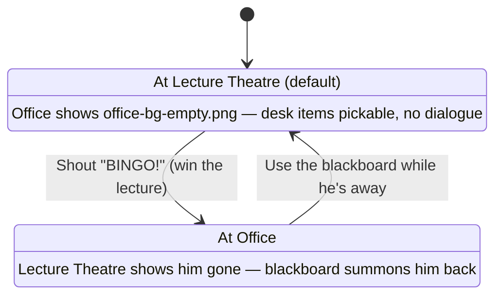

# The Secret of the Lost Codebook — Handover

*Project handover / internal reference — compiled 2026-09-15, last updated 2026-09-17 after the narrative throughline + trailer/title art pass*

A LucasArts-style point-and-click adventure teaching Research Methods, built as a single self-contained HTML file. This is the orientation doc for picking the project back up — what's live, how it's wired together, and what's still open.

**Play the current build:** https://claude.ai/artifact/1VJHdVezyJFxnsZXS3kRi6 (v45 · 2026-09-18 · Acts I–V, 10 rooms including Probability Pond)

v45 is current — everything through section 01f below is live, including voiced dialogue for the Office and Lecture Theatre, the Skeptic's voice in Probability Pond, room background music, and campus-map music. **Important lesson from this session: local edits and "it worked" verification (headless Chrome, etc.) do NOT mean the change is live** — the Artifact has to be explicitly republished every time, and it was very easy to lose track of this mid-session (the Office voiced-dialogue pilot sat local-only through the entire Lecture Theatre extension before anyone noticed the published version was still pre-audio). `title-theme.m4a` was not published (the Artifact host doesn't serve `.m4a`) — the `<audio>` element's `.mp3` fallback `<source>` handles this transparently, already verified working.

---

## 01b. Session changes (2026-09-17 — not yet published)

**Title renamed:** "The Secret of the Codebook" → **"The Secret of the Lost Codebook"** everywhere (`<title>`, `.gametitle`, both HANDOVER/ROADMAP docs). The game file itself was not renamed (still `the-secret-of-the-codebook.html`) to avoid breaking the existing published URL/bookmarks.

**Narrative throughline added.** Until this session "codebook" appeared nowhere in actual game text — only in the page title and internal JS names. Fixed with four small text edits, no restructuring:
- Lecture Theatre's opening line no longer spoils the bingo-card solution outright (used to say "whatever it is you do with a bingo card, you'll need it in hand first") — now he just rambles systems-theory jargon; the player has to discover the bingo trick themselves.
- The Corridor gate door's `Look At` now names the mystery for the first time: "ARCHIVE OF METHOD — THE CODEBOOK."
- The Doorman's line (on entering with the Question) states the stakes: pass all 4 cases to earn a look at the Codebook, fail and fall.
- The Corridor's `checkWin()` payoff reveals the joke: there is no single book — "the Codebook... is the whole department," setting up Acts II–V as its actual chapters.

**Office sidequest: the citation counter.** Fully implemented per the "light-touch" option logged in ROADMAP — a post-puzzle secret, not a blocker, so it doesn't touch the tuned W0–W4 professor dialogue tree:
- Only reachable after `whirlpoolDone` (already got the Question). `Talk To` the professor again then cycles three new idle lines, the second of which hints at "a small mechanical counter screwed to the corner of the desk."
- Craft: `Use` the pen `with` the corkboard → tears off a blank sticky-note corner, writes a fake citation → grants item `citationslip` ("Fabricated Citation").
- Payoff: `Use` that item `with` the professor → he takes it, the counter ticks over, one-time flag `profCited`.
- **No art yet for the counter prop itself** — it only exists in dialogue text, no scene hotspot. `citationslip` also has no icon (`ITEM_ICONS` entry deliberately omitted), so it renders as the "FA" text-fallback in inventory. Both are cosmetic gaps, not blockers; add a desk-sprite + icon whenever art is generated (same pipeline as every other pickup, see section 04).

**Boot splash + opening trailer, fully wired and tested.** A fixed-position `#bootSplash` overlay now plays before `CODEBOOK_START()` fires:
1. `logo-grundarts.png` (a LucasArts-boot-logo pastiche, real alpha transparency) on black, ~2.2s or click to skip.
2. `title-screen.png` (full-bleed painted title card, 1672×941, no transparency needed) with a "Click to Begin" prompt that only appears once **both** a minimum on-screen time *and* a background preload of every Act I/trailer PNG have completed (see the `PRELOAD` array right above `CODEBOOK_START()`) — so Act I's art is already warm in cache by the time the trailer/map needs it.
3. Clicking Begin always plays the 4-panel Monkey-Island-style narrated trailer (`PANELS` array, same script) — full-bleed art + a caption card + "click or press space to continue," one panel at a time — every visit, not just the first. `CODEBOOK_START()` fires on the last panel.
4. **Escape**, at any point during the trailer, jumps straight to the end (skips remaining panels, calls `CODEBOOK_START()` immediately).

All of the above verified end-to-end via headless Chrome/CDP this session (panel order, returning-player skip, `cc_bg` archway swap).

**Corridor archway art wired in.** `checkWin()` now cross-fades `cc_bg` to `corridor-archway-bg.png` (and clears the old door/label hotspots via `clearZones()`) the moment all 4 cases are solved, instead of just changing text over the last case room's background — same fade pattern `startFall()` already used for the failure state.

**New art shipped this session** (all 1672×941, dropped straight in with no cropping needed): `corridor-archway-bg.png`, `title-screen.png`, `logo-grundarts.png`, `trailer-panel1-rejection.png`, `trailer-panel2-protagonist.png`, `trailer-panel4-legend.png`, `trailer-panel5-arrival.png`. Sources archived in `art/corridor/source-corridor-archway-bg.png` and `art/trailer/source-*.png`.

**Not done — still open:**
- **Trailer panel 3 ("The Rumor") generated and wired in** (2026-09-17, later same day) — all 5 panels now play in order, verified via headless Chrome. The `PANELS`/`PRELOAD` arrays near the bottom of the file are complete.
- **Trailer now always plays, every visit** (the earlier `seenIntro`-skip design was dropped) — **Escape** during the trailer jumps straight to the map instead.
- **Corridor ending rewritten** to match `STORY.md`'s two-stage reveal: `checkWin()` no longer spoils "it's the whole department" — stepping through the archway now plays the Doorman exchange ("Not here." / "This was the door." / "You've completed Chapter One.") and converts the `question` item into a persistent `folder` item (`Research Folder — Question Exists`) instead of deleting it.
- **Bug fix:** inventory items with no icon (the `folder` item above, and the earlier `citationslip` sidequest item) rendered invisible fallback-initial text — cream-colored text on the cream slot background. Fixed via an explicit `color`/`font` rule on `.side-inv-slot.filled`.
- Citation-counter desk prop + `icon-citationslip.png` (see above) — cosmetic only, mechanic works without them.
- Magnifying-glass relocation from a prior session — **this one is done**, confirmed live: it now sits on the desk beside the "Drittmittel-funded" sign (`left:58.5%;top:44%` in `office-bg-empty.png`), not on the floor. Ignore any older note claiming otherwise.

---

## 01g. Session changes (2026-09-18, later still): Act I art touch-up pass (Lecture Theatre + Probability Pond)

**Not yet published.** The user asked for a general read on the project's artwork tone — assessment: Office, Corridor, and the campus map are all dense with visual sight-gags (skeleton props, deadpan signage), but the Lecture Theatre and especially Probability Pond were comparatively bare (Pond in particular was just one joke — the plaque — in an otherwise straight, pretty scene). Wrote ChatGPT image-*edit* prompts (attach the existing background, add specific new props without touching composition/lighting/style) for both, the user ran them, and all three results were installed directly over the existing files:
- **`lecture-bg.png`** replaced — added a "OFFICE HOURS: Yes." chalk note in an empty blackboard corner, a wry brass plaque under the wall portrait ("FOUNDING CHAIR, DEPT. OF CAUSALITY — STILL AWAITING TENURE REVIEW (EST. 1889)"), a mug + "URGENT" sticky note stack on the lectern, and "THIS SEAT HAS SEEN THINGS" carved into a front-row desk.
- **`pond-bg.png`** replaced — added a paperback of *The Black Swan* + a coffee cup on the bench, a second sign ("PLEASE DO NOT FEED THE OUTLIERS") near the existing plaque, and one out-of-place yellow rubber duck floating among the swans.
- **`pond-bg-falsified.png`** replaced too — the user generated this variant with the same three additions *already baked in* on top of the existing black-swan/FALSIFIED-stamp treatment, so the two Pond states stay visually consistent (this was flagged as a risk beforehand; the user's own ChatGPT session handled it correctly without needing a second edit pass).

**Verified before installing:** all three new PNGs are still exactly 1672×941 (matching every other room background); the Lecture Theatre's ink-bottle pickup sprite position (`left:66.5%;top:58.5%`, pixel-cropped and diffed against the old art) sits over unchanged wood paneling, unaffected by the new lectern clutter; the Pond's four hotspot rectangles (`swanright`, `swanleft`, `plaque`, `philosopher`) don't overlap the new duck or the new "outliers" sign (checked by converting the percentage hotspot boxes to pixel coordinates and cropping). Also verified live in headless Chrome with real game state (professor sprite over the new lecture art, ink bottle in place, swans/duck/signs all rendering correctly in the actual room).

**Not done:** Corridor and the campus map were assessed as already dense enough and were left untouched, per explicit scope ("just focus on act 1" — and even within Act I, only these two rooms needed the pass). Acts II–V remain fully out of scope (no art exists there at all yet — see the room-by-room note in 01f below if that ever becomes the next task).

---

## 01f. Session changes (2026-09-18, later still — published as v46): campus-map music, Skeptic's voice, character-voice casting notes

**Republished (v45, then v46 after the Pond/map additions below).** Sections 01d and 01e below had been sitting local-only — the Artifact was still serving the pre-audio version, which is why the Lecture Theatre "dialogue doesn't play" when the user actually tested the *live* link. All 23 audio files (10 Office + 11 Lecture Theatre + 2 bgm) plus the updated `index.html` were published together as v45; the campus-map music + Skeptic's voice files went out as v46. **Lesson recorded above in the top summary — always confirm which surface (local file vs. live Artifact) a "doesn't work" report is about before debugging code.**

**Campus map now has background music too:** `title-theme.mp3` (the existing boot-splash track) loops at volume 0.15 via `showMap()` calling `CODEBOOK_STOP_ROOM_MUSIC()` then `CODEBOOK_PLAY_ROOM_MUSIC('title-theme.mp3', 0.15)` — same shared helpers as the room bgm, so map ↔ room transitions always fade the old track before starting the new one.

**The Skeptic (Probability Pond) now has a voice — Moira (macOS built-in, Irish).** Her dialogue is structurally different from the Office/Lecture Theatre professor: each `setLine('You', ...)` call in this room is one narrated paragraph mixing the player's own line, third-person narration, *and* her quoted speech together (e.g. "&ldquo;Nice sign,&rdquo; you say... She doesn't look up. &ldquo;It's not evidence, it's a headline,&rdquo; she says..."). Rather than voice the whole mixed block (which would have the player's words coming out of her mouth) or split the visible text into multiple bubbles (which would have changed the writing), **the audio track was decoupled from the displayed text**: three clips (`pond-skeptic-reject.mp3`, `pond-skeptic-convinced.mp3`, `pond-skeptic-holds.mp3`) contain *only* her isolated quoted words, passed as the existing `setLine(speaker, html, cls, audioSrc)` 4th argument while `html` keeps the full original mixed-narration text on screen unchanged. This pattern — audio and caption text no longer required to be verbatim matches — is worth reusing anywhere else dialogue is written in this "narrated exchange" style rather than clean single-speaker attribution.

**Character-voice casting is now a hard constraint, not just "use `say -v Daniel`":** the user wants a genuinely different, natural-sounding voice per character, and ruled out every remaining built-in macOS "compact" voice for The Doorman (Corridor) as "too artificial" after live A/B (Ralph, Rocko, Fred, Eddy UK, Albert, Reed US, Reed UK all rejected — only Daniel and Moira have cleared the bar so far). **Downloading a Premium/Enhanced system voice was attempted but abandoned** — this session's macOS build didn't expose a "Manage Voices" affordance in the location that used to work, several rounds of settings-navigation guidance failed, and neither party could locate the download UI. **Decision: The Doorman ships silent for now** (same as Survey Lab/Library, which have no character-speaker at all — those rooms use instructional feedback panels, not a dialogue-bubble persona, so they were never in scope for voicing anyway). If a better voice route appears later (a working Premium voice download, or revisiting ElevenLabs), The Doorman's lines are already identified and ready to wire in: see the `CORRIDOR` speaker breakdown below.

**Full remaining-room speaker survey (for whenever voicing resumes beyond Act I),** by room and character — narration-tagged lines (not real quoted speech) are marked *(skip — narration)* per the precedent set in the Lecture Theatre:
- **Corridor** (Act I): `The Doorman` (6 lines, real quoted dialogue, blocked on voice choice — see above); `System` (10 lines) — *(skip — narration, not a spoken character; also carries per-door `feedback` text data, 16 more entries, same call)*.
- **Mensa** (Act II): `System` (2 lines) — needs a read to confirm whether these are narration or an actual voiced character before deciding.
- **Survey Lab** (Act II): no speaker-tagged dialogue at all — pure quiz-feedback panels (`.feedback` divs keyed to answer choices). Not a fit for this voicing pattern.
- **Library** (Act III): same as Survey Lab — feedback-panel structure, no speaker persona.
- **Statistics Basement** (Act III): `System` (3 lines) — same caveat as Mensa, unconfirmed.
- **Delegation Engine** (Act IV): `KIRA` (7 lines) — the rolling robot companion (`CODEBOOK_KIRA_ROLL`); a genuinely different character from anything voiced so far, worth a distinct (possibly robotic-but-not-rejected-as-artificial, TBD) voice.
- **Hypotheses Accelerator** (Act V): `PROF. FELDSTROM` (3 lines) — a **different, named professor**, distinct from the unnamed "Prof." in Office/Lecture Theatre; needs its own voice, not Daniel.

---

## 01e. Session changes (2026-09-18, later — not yet published): Lecture Theatre voiced dialogue + room background music

**Voiced dialogue extended to the Lecture Theatre**, same `say -v Daniel` → `ffmpeg` pipeline as the Office pilot below. 11 clips generated (not all 5 `setLine('Prof.', ...)` call sites' text is actually *spoken* dialogue — see judgment call below): the 8 `LINES[]` bingo-term reveals (`lecture-line-communication.mp3` etc.), the jargon-ramble opening line (`lecture-opening.mp3`), the "delighted" summon-professor line (`lecture-summon.mp3`), and one of the four `AMBIENT_LINES` entries (`lecture-ambient-quote.mp3`).
- The room's local `setLine(speaker, html, cls)` already had a third parameter (CSS class, used for the "BINGO!" win styling) — added a fourth: `setLine(speaker, html, cls, audioSrc)`, calling `window.CODEBOOK_PLAY_LINE_AUDIO(audioSrc)` exactly like the Office's version.
- **Judgment call: three of the four `AMBIENT_LINES` and the "lecture derailed" win line were deliberately left silent.** Unlike the Office (where every `Prof.` line is something he actually says), this room mixes true quoted speech with third-person narration *tagged* as `Prof.` (e.g. "He is mid-sentence about something that might be Luhmann..." — narration about him, not something he'd say about himself). Voicing narration in his own voice would sound broken, so only the lines that are genuinely his words (the 8 bingo lines, the opening ramble, the summon line, and ambient-line #2, which is an actual quote) got audio. If more of this room's narration-tagged lines get rewritten as real quotes later, they're easy to add — `AMBIENT_LINES` entries are now `{text, audio}` objects instead of bare strings, so any entry just needs an `audio:` key added and a clip generated.
- Verified via headless Chrome + `HTMLMediaElement.prototype.play/pause` instrumentation: entering the room auto-plays `lecture-opening.mp3` with the correct line text, and Space stops it cleanly — same behavior as the Office pilot.
- **Bug found by the user, fixed same day:** the original `lecture-opening.mp3` and `lecture-summon.mp3` clips voiced the *entire* line including the narrator's stage directions ("He clears his throat and taps the lectern... He does not appear to be building toward a point"), so the audio read like both a narrator and the professor talking. This was the same mistake the Skeptic's audio (Probability Pond, section 01f) had already been fixed for — mixed narration+quote lines need the audio decoupled from the caption text, not voiced verbatim. Fixed by regenerating both clips to contain *only* the professor's actual words, matching visible-text quotes exactly (`setLine`'s `html` argument is unchanged, only the `audioSrc` clips changed) — except the opening line's delivery was deliberately loosened at the user's request, adding "blah, blah, blah, systems, blah blah" as spoken filler to sell the joke that he's rambling without saying much, even though the on-screen caption stays the tidier "Autopoiesis. Structural coupling. Double contingency. Operative closure." **Lesson for any future line in this room (or elsewhere): before voicing a mixed narration+quote block, always ask "would voicing the FULL text in his voice sound like the narrator is also him?" — if yes, split it, don't just voice the whole thing because it's short.**

**Room background music added — Office and Lecture Theatre only, user-supplied tracks.** Two AI-generated instrumental tracks the user dropped in Downloads (`The Stately Academic Melody.mp3` → `office-bgm.mp3`, `Clockwork Lectures.mp3` → `lecture-bgm.mp3`), re-encoded via `ffmpeg` (`libmp3lame -q:a 5`) and placed in `web/`.
- New shared engine helpers, alongside the line-audio ones: `window.CODEBOOK_PLAY_ROOM_MUSIC(src, volume)` (loops, default volume 0.15, dedupes if the same track is already playing) and `window.CODEBOOK_STOP_ROOM_MUSIC()` (10-step fade-out over ~400ms, same pattern as the existing boot-splash `fadeOutMusic()`). This is a **separate audio channel from the voiced-line audio** — Space does not touch it, only dialogue.
- `enterRoom()` and `showMap()` (the two central navigation functions) both call `CODEBOOK_STOP_ROOM_MUSIC()` on every transition, so switching rooms always fades the old track out before the new room's `init()` (if any) starts its own. This means adding music to a future room is a one-line change in that room's `init()` — no navigation-code changes needed.
- Each room's `init()` starts its own track at the top: `window.CODEBOOK_PLAY_ROOM_MUSIC('office-bgm.mp3', 0.15)` / `'lecture-bgm.mp3'`. Volume picked to sit clearly under the `say`-generated voice clips (which play at default volume 1.0) rather than competing with them.
- Verified via headless Chrome: entering the Lecture Theatre plays `lecture-bgm.mp3` (looped, vol 0.15) *and* `lecture-opening.mp3` (vol 1) simultaneously; Space pauses only the dialogue clip; leaving to the map pauses the bgm (after fading); entering the Office then starts `office-bgm.mp3`.
- **Not done:** no other room has background music yet (Corridor, Pond, Acts II–V) — same "extend on request" posture as the voiced-dialogue rollout.

---

## 01d. Session changes (2026-09-18 — not yet published): voiced dialogue pilot, Office room only

**Pilot for real voiced dialogue, scoped to the Office's W0–W4 professor tree only** (9 nodes, 10 clips counting the two `W3-callout` variants). Generated with macOS's built-in `say -v Daniel` (free, no signup, no self-hosting — chosen over ElevenLabs/Piper/etc. after comparing four candidate voices live), converted to mp3 via `ffmpeg`. Files: `office-w0.mp3`, `office-w1.mp3`, `office-w1-retry.mp3`, `office-w1b.mp3`, `office-w2.mp3`, `office-w3.mp3`, `office-w3-callout-a.mp3`, `office-w3-callout-b.mp3`, `office-w4-win.mp3`, `office-lose.mp3` — all in `web/`, ~35–130KB each, not yet archived to an `art/` source folder (there's no non-web "source" for these the way there is for images; the raw `.aiff` files live only in scratchpad and weren't kept).

**Architecture: purely additive, as anticipated when this was first discussed.** No restructuring was needed:
- New shared helpers in the main engine IIFE: `window.CODEBOOK_PLAY_LINE_AUDIO(src)` (stops whatever's currently playing, plays the new clip — only one line's audio ever plays at once) and `window.CODEBOOK_STOP_LINE_AUDIO()`.
- The Office room's local `setLine(speaker, html)` gained a third optional parameter: `setLine(speaker, html, audioSrc)`, which calls the shared play helper. Every other room's `setLine` is untouched and still works exactly as before — this was rolled out to one room only, on purpose, as the pilot.
- One line (`W2`) has the visual text include a quoted aside from the player ("Player: ... ") in the middle of the professor's speech bubble. Rather than split it into multiple audio triggers for one `setLine` call, the whole block was voiced as one continuous clip, read as the professor sarcastically reciting the player's answer back before shooting it down. Reads fine, but worth knowing if extending this pattern — a genuinely multi-speaker line needs a different approach (e.g. multiple `setLine`-adjacent audio cues) if that sarcastic-recitation framing doesn't fit some future line.

**Space now also stops voiced audio, not just dismisses captions.** The existing Act I `keydown` handler (`document.addEventListener('keydown', ...)` in the shared engine) was extended: it now calls `CODEBOOK_STOP_LINE_AUDIO()` in addition to dismissing the `.scene-caption`, and only calls `preventDefault()` if it actually did one of those two things. Verified via a `HTMLMediaElement.prototype.play`/`pause` instrumentation hook in headless Chrome: clicking a dialogue node logs `play`, and an immediate Space press logs `pause` — confirmed working, including the case of re-triggering the *same* line (correctly pauses the old instance and starts a fresh one rather than ignoring the repeat).

**Not done:** every other room's dialogue is still silent. If this pilot reads well in actual play, extending it means: (1) generating clips for that room's lines the same way, (2) adding the same third `audioSrc` parameter to that room's own local `setLine`, (3) passing the right filename per line. No shared-engine changes needed for future rooms — the helpers already used by the Office are global.

---

## 01c. Session changes (2026-09-17, later still — not yet published)

**Boot-splash music added.** `title-theme.m4a`/`.mp3` (an AI-generated "Autumn Library" track) loops under the entire logo → title → trailer sequence via a new `<audio id="bootMusic">` inside `#bootSplash`. Autoplay is attempted on load but browsers usually block it without a gesture, so `startMusic()` also fires on the first click/keydown anywhere in the splash; `fadeOutMusic()` ramps volume down over ~400ms in `closeSplash()`. Since the whole `#bootSplash` div (audio element included) gets `.remove()`'d when the splash closes, there's no lingering-playback risk once gameplay starts — verified via headless Chrome.

**Citation-counter prop art shipped and wired in.** Real art now exists (`sprite-citationcounter.png`, brass hand-crank tally counter, reads "9,999") — placed as a desk-corner overlay sprite + `Look At` hotspot (`data-id="counter"`, ~`left:75%;top:42.5%`) in the Office, mirroring the magnifying-glass sprite pattern. The counter joke got sharper too: the professor now explicitly explains the department wants five digits by Friday or it's "an early retirement conversation," and citing him ticks it to exactly 10,000 with a deadpan non-reaction. **Known gap:** the sprite image is static art showing "9,999" — it does not visually update to "10,000" after the citation is given, only the dialogue says so. Would need a second sprite variant to fix.

**Trailer dialogue and structure revised**, following a rethink of the whole story (see `STORY.md` for the reasoning):
- Panel 1's narration no longer mentions "REVISE AND RESUBMIT" (text: *"Every research project starts the same way: a deadline, an empty folder, and nothing else."*) — **and the art now matches**: `trailer-panel1-deadline.png` (empty "RESEARCH PROJECT" folder + a calendar circled "DUE") replaced the old rejected-letter image, verified live. The old `trailer-panel1-rejection.png` was removed from `web/` (still archived as `art/trailer/source-trailer-panel1-rejection.png`).
- New **Panel 2b ("The Spiral")** generated and wired in between "The Protagonist" and "The Rumor" — the trailer is 6 panels now, verified in order via headless Chrome.
- Panel 4's line changed from "...reassigned to committee work" to "...still working on their dissertations" (ties into the existing armchair-skeleton joke instead of a flat non-sequitur).
- The ending (not yet built in code — still design-only in `STORY.md`) no longer treats "REVISE AND RESUBMIT" as a callback to a stamp shown earlier; it's now the *only* time that phrase appears, explicitly explained in-dialogue as good news, with a "Part Two: The Revisions" credits gag.

**Office desk-clutter bug fixed.** `office-bg-empty.png` never had the six pickup items painted into it (only `office-bg.png`, professor-present, did) — confirmed root cause of "picking things up doesn't change the scene." Fixed via an image edit (attach `office-bg.png` + the old empty version, ask only to remove the professor and replace with the empty chair, keep everything else identical) — this worked cleanly on the first real attempt (a prior *fresh-generation* attempt, not an edit, came back ~96% pixel-different and still had no clutter — not usable, confirms edit-not-generate is the right approach for this kind of fix).
- Old `office-bg-empty.png` (the fully-cleared, "everything collected" state) renamed to **`office-bg-empty-cleared.png`** and kept — the existing six `patch-*.png` files are correctly cropped from it and still work.
- New `office-bg-empty.png` installed with all six items visible. Checked every item's position against the old hotspot coordinates: **hourglass, USB, pen jar, and stamp barely moved** (existing hotspots still work). **Only the mug moved significantly** (from ~46%/48% to ~73%/52%, now sitting on a small side table near the bust/filing cabinet) — its hotspot, `STAND_X`, and `wp_patch_mug` position were all updated to match.
- **Known cosmetic gap:** `patch-mug.png` is still the *old* patch (cropped from the old fully-cleared background at the old position), just resized into the new spot. It's a plausible-enough stand-in — no clean nearby texture existed to crop a proper new patch from (the new spot is a cluttered corner: bust, radiator, filing cabinet) — and it reads fine at normal gameplay resolution (verified), but it isn't a pixel-perfect "item removed" render. A proper fix would need a dedicated image edit of just that corner with the mug removed.
- The Likert-scale die's *position* also survived roughly intact, but its actual art in the new image is a generic 20-sided fantasy die, not a die with Likert-response-labeled faces — a minor content mismatch, not a positioning bug. Not fixed this session.

**Probability Pond fully built, wired in, and tested end-to-end.** New room `id: 'pond'`, Act I, `prereq: null` (always open like the other three Act I rooms), registered right after the Corridor in the script. Modeled on the Lecture Theatre's zone pattern (`STATIC_EXTRAS`/`addZone`/`handleZoneClick`), not the Office's `PICKUPS` pattern, since there's no professor here.
- **Map:** new `MAP_LAYOUT.pond` box (`l:0,t:220,w:165,h:170` — the free vertical band between `surveylab` and `delegation`; doesn't visually align with the pond graphic's actual position at the map's bottom-left, since that area is already claimed by `delegation`'s box, but every hotspot box in this game is an invisible click target, not a visible outline, so this is a non-issue in practice). Verified the "Probability Pond" title tooltip appears and the room opens correctly.
- **Ink pickup, in the Lecture Theatre (not the Pond)** — this is the one deliberate cross-room dependency tying the new room to existing Act I content. Added `lt_sprite_ink` (an `icon-blackink.png` overlay near the lectern, floor-level next to the wastebasket) and a new `STATIC_EXTRAS` entry (`kind:'pickup'`) with its own flag `lectureInkTaken`. **This required adding `kind === 'pickup'` handling to the Lecture Theatre's `handleZoneClick`, which didn't exist before** (Lecture only supported `lookat`/`doodle`/`prof`/`board`) — mirrors the Corridor's existing pickup-kind logic.
- **The puzzle itself:** two swan hotspots (`swanleft`, `swanright`) plus a `plaque` hotspot. Only `swanright` accepts the ink (matches where `sprite-blackswan.png` is positioned); `swanleft` has its own rejection line ("paddles away... has clearly seen this before") so trying the "wrong" swan doesn't feel like a bug. `Use` ink `on` `swanright` removes the ink item, shows the black-swan overlay, sets `pondDone`, and the plaque's `Look At` text changes permanently to acknowledge the claim was revised. State persists correctly on room re-entry (checked via `ctx.hasFlag('pondDone')` on init).
- Both `icon-blackink.png` and `sprite-blackswan.png`/`sprite-citationcounter.png`/`pond-bg.png` added to the `PRELOAD` array (the citation-counter sprite had been missed in an earlier pass — fixed here too).
- Verified via headless Chrome: map hotspot exists, ink picks up in the Lecture Theatre, wrong swan rejects, right swan falsifies correctly, plaque text updates, ink is consumed from inventory.

**Probability Pond, round 2 — two real bugs caught by the user and fixed same session:**
1. **The sprite-overlay approach for the black swan never fully worked.** The plan was: precisely measure the white swan's bounding box, resize/position `sprite-blackswan.png` to match, done. In practice the AI-generated black swan's exact silhouette doesn't pixel-align with the white swan's (different neck curve, slightly different tail angle), so no matter how carefully the box was measured, a sliver of white swan always showed through the gaps. Tried a second fix — composite a same-sized water-texture patch first (self-cloned from open water elsewhere in the same image, `patch-pondswan.png`) to erase the white swan before laying the black one on top — which worked visually in an isolated ImageMagick test, but the user (correctly) didn't love relying on a clone-stamped patch for something this visible.
2. **The real fix, at the user's suggestion: generate the whole "falsified" scene as one image instead of compositing sprites.** The user generated `pond-bg-falsified.png` — the identical pond, right swan already black, plaque already stamped "FALSIFIED" in red — and the room now just swaps `pd_bg`'s `src` to this file (same fade-swap pattern as the Corridor's `corridor-fall-bg.png`/`corridor-archway-bg.png`), instead of toggling sprite/patch overlays. This is categorically more robust for any "the scene permanently changes" moment: **swap the whole background image, don't try to surgically composite a change into the existing one**, unless the change is a small isolated object with generous empty space around it (like the desk pickups). `sprite-blackswan.png` and `patch-pondswan.png` are deleted; the plaque's falsified `Look At` text was rewritten to match what the new art actually shows.
3. **Map hotspot was badly mispositioned** (`{l:0,t:220,w:165,h:170}` — a functional-but-arbitrary placeholder box in free space, never actually checked against where the "Probability Pond" sign sits in `campus-map-bg.png`). Remeasured properly: the sign+pond area is at `{l:0,t:459,w:266,h:165}` in the map's 1200×675 space — which fully overlaps the Delegation Engine's existing box (`{l:0,t:400,w:260,h:230}`). Since Acts II–V have no dedicated map signage to align with anyway (confirmed by inspection — only Act I rooms have named signs on the map), **`delegation`'s box was moved** to `{l:450,t:440,w:240,h:190}` (open space between the Corridor and the Accelerator) rather than compromise the Pond's correct position. Verified via `getBoundingClientRect()` that the Pond hotspot now sits at 68–92% down the map image, matching the visible sign almost exactly.

**Probability Pond promoted from optional sidequest to a required gate, with a new character.** At the user's request, the falsification puzzle is now embedded in the main critical path rather than being flavor-only (see `STORY.md`'s Cast and Act I sections):
- New character **The Skeptic**, voice-only (sits on the pond's existing bench, no dedicated art), new hotspot `data-id="philosopher"` on the Pond scene (`left:68%;top:78%;width:30%;height:20%`).
- `Talk To` him before the swan is painted gets the falsifiability challenge. `Talk To` him again *after* painting the swan (`falsified === true`) delivers the "explain it" beat and sets `ctx.setFlag('philosopherConvinced')` — deliberately two separate steps (demonstrate, then explain) rather than one, matching the user's original ask.
- **The Corridor's `handleRing()` now hard-gates on this flag.** Previously it only checked `ctx.hasItem('question')`. It now checks `question` first (same rejection as before if missing), then checks `philosopherConvinced` — if the player has the Question but hasn't convinced the Skeptic, the Doorman gives a distinct rejection line ("there's a man by the pond who does — convince him first") and does *not* let them in, even with a valid Question. Verified all four states via headless Chrome: blocked-without-Question, blocked-with-Question-but-not-convinced, the full convince sequence, and finally successful entry.
- This was originally scoped as a *non-gating* bonus (a flavor line from the Doorman acknowledging the Skeptic's approval, no mechanical change) to avoid risk to the tuned Corridor puzzle — the user explicitly asked for it to be a hard requirement instead, so it now is. The change is isolated to `handleRing()`'s branching and doesn't touch the four in-Corridor case rooms themselves, so the actual causal-reasoning puzzle is untouched.

**New room designed, not yet built: Probability Pond.** A Popper's-falsifiability joke — two white swans, a plaque claiming "ALL SWANS ARE WHITE," black ink picked up in the Lecture Theatre, used on a swan to falsify the claim. Full design in `STORY.md`; art prompts (background, ink icon, blackened-swan overlay sprite) in `art/pond/ART_PROMPTS.md`. Nothing coded yet — no room registered, no map hotspot, no ink pickup in the Lecture Theatre.

---

## 01a. Session changes (2026-09-15, superseded)

*Everything in this section shipped and was published as v43 in the 2026-09-16 session (side panel width, verb/inventory font size, magnifying glass move, Space-to-dismiss `.scene-caption`, professor repositioning in the Lecture Theatre, the 6 regenerated `patch-*.png` files). Kept here only for the git-free backup paths below; see section 01b above for what's actually still unpublished.*

**Backups (local, not in git — this project has no git repo):**
- `backups/the-secret-of-the-codebook.pre-mi-captions.<timestamp>.html` — full file snapshot from before the Monkey-Island caption move.
- `backups/patch-{hourglass,mug,penjar,stamp,usb,likertdie}.png` — the original (buggy, professor-containing) patch images.

---

---

## 01. What's actually playable right now

Act I (the first three rooms) is the finished, polished slice: fully painted backgrounds, a real puzzle loop, and the game's current signature mechanic — the professor physically moves between two rooms depending on what you've done. Acts II–V exist and are functionally playable, but visually they're still in an earlier, flatter style (procedural SVG scenes, no commissioned art) and use an older, stricter unlock pattern than Act I does. See the callout in section 03 — this is the single most important thing to know before touching those rooms.

| Act | Room | Unlock rule | Art |
|---|---|---|---|
| I | **The Seven-Second Office** `id: whirlpool` | always open | painted |
| I | **Introduction to Systems Theory** `id: lecture` | always open | painted |
| I | **Causality Corridor** `id: corridor` | always open | painted · 4 rooms |
| II | **The Mensa** `id: mensa` | needs `corridorDone` | flat / procedural |
| II | **Survey Lab** `id: surveylab` | needs `mensaDone` | flat / procedural |
| III | **The Library** `id: library` | needs `surveyDone` | flat / procedural |
| III | **Statistics Basement** `id: statsbasement` | needs `libraryDone` | flat / procedural |
| IV | **The Delegation Engine** `id: delegation` | needs `statsDone` | flat / procedural |
| V | **The Hypotheses Accelerator** `id: accelerator` | needs `delegationDone` | flat / procedural |

Every room, including the locked ones, is reachable directly by seeding `localStorage` during testing — see section 05.

---

## 02. How the file is built

Everything lives in one file: `web/the-secret-of-the-codebook.html` (~3,700 lines). No build step, no bundler — it's published as-is via the Artifact tool, with the PNGs shipped alongside it as supporting files. There's a small shared engine at the top, then one `<script>` block per room that self-registers.

### Room registration

```js
CODEBOOK_REGISTER({
  id: 'lecture', act: 'Act I', title: 'Introduction to Systems Theory',
  doneFlag: 'lectureDone',
  prereq: null, lockedHint: '',      // null = always open (Act I rule)
  html: `<div class="room-columns">...</div>`,
  init: function(ctx){ /* wires up hotspots, verbs, dialogue */ }
});
```

`ctx` is the room's only handle on shared state: `ctx.GAME`, `ctx.hasItem/addItem/removeItem`, `ctx.hasFlag/setFlag/clearFlag`, `ctx.complete()` (sets the room's `doneFlag`), `ctx.goMap()`. All of it persists to `localStorage` under `codebook_save_v1` on every write.

### The shared UI pattern (Office, Corridor, Lecture Theatre)

A verb grid (**Look At / Talk To / Pick Up / Use**) plus an inventory grid in a fixed side panel, rendered by one shared helper, `window.CODEBOOK_RENDER_SIDE_INV(...)`, called from each room's own `syncSideInv()`. Clicking an inventory slot sets the verb to **Use** and selects that item, so hovering a hotspot reads *"Use A Bingo Card with the professor"* — the sentence line updates live via a per-room `updateSentence()`. This is the one piece of near-duplicated logic across rooms; a shared helper was never extracted, so a change to the pattern currently means editing it three times.

### Narration display: `.scene-caption` vs `.panel` (Act I only — see 01a)

As of this session, Office/Corridor/Lecture Theatre render the current `.speaker`/`.line` text inside a `.scene-caption` card overlaid on the scene art (Monkey-Island-style), not inside `.panel`. `.panel` is now response-buttons-only for these three rooms. The JS is untouched — `setLine()` in each room still just writes to `#xx_speaker`/`#xx_line` by ID; only the markup location and CSS changed. Each room's caption has its own anchor (inline `style` override on the `#xx_caption` element) chosen to avoid that scene's hotspots/characters, plus a `tail-down` or `tail-up` class picking which edge gets the little triangular pointer. Acts II–V (and any future room) do **not** have this — they still render speaker/line inside `.panel` the original way. If you extend the caption treatment to more rooms, budget time to eyeball each new scene for a clear spot; there's no dynamic per-hotspot anchoring, just a hand-picked position per room.

### The professor: one entity, two rooms

The newest and most structurally interesting mechanic. A single boolean flag, `GAME.flags.profAtOffice`, says where the professor currently is — unset means he's at the Lecture Theatre (the default at game start), set means he's at the Office. Each room reads it once on `init()` and swaps its background image and dialogue availability accordingly.



This is the first flag in the codebase that needs to go both ways, so a `clearFlag(k)` engine helper was added alongside the existing (set-only) `setFlag`/`hasFlag`. Anywhere else in the game that needs a toggle rather than a one-way unlock should reuse `ctx.clearFlag` rather than inventing a second mechanism.

---

## 03. Known inconsistency, worth fixing before Acts II–V get more content

> **⚠ The stated design rule and the actual code disagree.** Partway through Act I's build, the explicit rule became: *every room is open from game start; progress is gated by what you've done, never by a map lock.* That was applied to all three Act I rooms (`prereq: null` on each) and to the professor-toggle mechanic. It was never retrofitted onto Acts II–V — those six rooms still use the original sequential-chain pattern, each one's `prereq` checking the previous room's `doneFlag` (see the table in section 01).
>
> Whoever picks this up next should either (a) explicitly decide Act I's rule was Act-I-specific and document that, or (b) unlock Acts II–V the same way and move any real gating inside each room. Leaving it silently inconsistent is the worst of the three options.

> **ℹ Related:** Acts II–V also predate the painted-art pass and the verb-grid/side-panel UI — they're still flat procedural SVG scenes without inventory panels. Bringing them up to Act I's visual and interaction standard is the largest remaining scope in the project, not a quick pass.

---

## 04. Getting new art into the game

This is the loop that produced every painted asset shipped so far — Office, Lecture Theatre, all four Corridor rooms, the campus map, and every pickup icon.

1. Write a precise ChatGPT image prompt (composition, framing, what needs to stay isolated/transparent for later cropping) and hand it to the user, or generate directly if asked.
2. User saves the result to `~/Downloads`. Always check **all** matching files there before picking one — regenerations often land as 3–4 near-duplicates with adjacent timestamps.
3. Verify before using it: `identify -format "%wx%h"` for dimensions, and `identify -verbose file.png | awk '/Alpha:$/{found=1} found{print}'` to confirm real (not just apparent) transparency on anything meant to overlay a scene.
4. For hotspot/sprite placement: overlay a magenta/cyan pixel grid at 100px, then a tighter 25–50px crop over the target area, read coordinates off it, convert to `%` of the native image size for CSS.
5. For anything whose placement is uncertain (visibility, fit): composite it locally first — `magick base.png ( overlay.png -resize WxH ) -geometry +X+Y -composite test.png` — and look at the result before touching the live page. This caught real bugs (an invisible magnifying glass, a badly-placed bingo card) that screenshot-based browser testing alone missed.
6. Archive the source in `art/<room>/`, install the trimmed/resized final in `web/`, wire it into the HTML, test locally (section 05), then publish with the new file(s) explicitly listed — see the warning below.

> **⚠** Republishing the HTML text alone does **not** update images already referenced by it. Any publish that touches assets must pass them via the Artifact tool's `files` parameter, or the live page keeps serving the old (or missing) PNGs.

---

## 05. Local dev & testing

```bash
cd web/
python3 -m http.server 8934
# then open http://localhost:8934/the-secret-of-the-codebook.html
```

To jump straight into a specific game state instead of clicking through from the map, seed the save before navigating:

```js
localStorage.setItem('codebook_save_v1', JSON.stringify({
  inventory: ['bingocard'],
  flags: { profAtOffice: true }
}));
location.reload();
```

Always `localStorage.removeItem('codebook_save_v1')` after testing and before publishing, so the shipped link starts fresh. Real mouse clicks work fine for a human player; automated clicks (browser-automation tooling) can miss small hitboxes even when the CSS math checks out — dispatching via `document.querySelector(...).click()` is the reliable fallback for scripted verification.

---

## 06. Repo layout

```
web/                              # everything that ships
  the-secret-of-the-codebook.html   # the whole game — source of truth
  *.png                              # every installed game asset
  *-art-prompts.html                 # reference docs of prompts used per room
  causality-corridor.html, delegation-engine.html,
  statistics-basement.html, survey-lab.html,
  the-library.html, the-mensa.html, whirlpool-office.html
    ^ standalone prototypes, one per room, predating the merge into
      the single file above. Likely stale — confirm with the user
      before deleting; nothing in the live game reads from them.

art/                              # source art, organized by room
  office/, lecture/, corridor/, map/, characters/professor/, trailer/
    ^ each holds source generations + candidates; trailer/ also has ART_PROMPTS.md,
      corridor/ also has ARCHWAY_PROMPT.md

backups/                          # pre-change snapshots this session made before editing (see 01a)
  the-secret-of-the-codebook.pre-mi-captions.<timestamp>.html
  patch-{hourglass,mug,penjar,stamp,usb,likertdie}.png   # the old, professor-containing patches

ROADMAP.md                        # the detailed, chronological changelog + backlog
STORY.md                          # the narrative bible: premise, cast, act-by-act plot, open story threads
```

This doc is the map; `ROADMAP.md` is the full trip log — every shipped change and every open idea is written up there in far more detail than repeated here. `STORY.md` is the narrative counterpart — read it before writing new dialogue or planning Acts II–V's story beats.

---

## 07. Open backlog, condensed

- **Not published yet.** Section 01b's changes are local-only. Publish via the Artifact tool, `files` covering every new PNG listed there.
- **Trailer is complete** — all 5 panels generated and wired in, always plays, Escape skips it. Not open anymore.
- **Citation-counter desk prop + `icon-citationslip.png`** — the sidequest (section 01b) works end-to-end through dialogue alone; a physical counter prop on the desk and a real inventory icon are cosmetic follow-ups whenever art gets made.
- **Acts II–V** need the same treatment Act I got: painted backgrounds, verb-grid/inventory UI, a decision on the always-open-vs-chained unlock question (section 03), and — if the Monkey-Island caption style (section 02) is a keeper — the same `.scene-caption` treatment, which touches markup only per room, no JS.
- **Mensa** has no side-panel/inventory display at all (a side effect of removing the old top-HUD inventory chips) — the raffle-drum mechanic still works, but the player can't see they're carrying it. Fix is giving it the same `side-inv` treatment Office/Corridor/Lecture Theatre already have.
- **Mensa room** has a second art-prompt set drafted ("slightly ridiculous") but never generated.
- **Corridor** wrong-door "falling" sequence has no dedicated transition art (uses a plain fade/scale) — not blocking, just not as polished as the rest of Act I.
- **Baked-in text** in `office-bg.png` ("Drittmittel-funded staff only") can't be removed without regenerating the art; an inpainting prompt was offered but never requested.

---

*the-secret-of-the-codebook.html · ~3,700 lines · single file, no build step*
